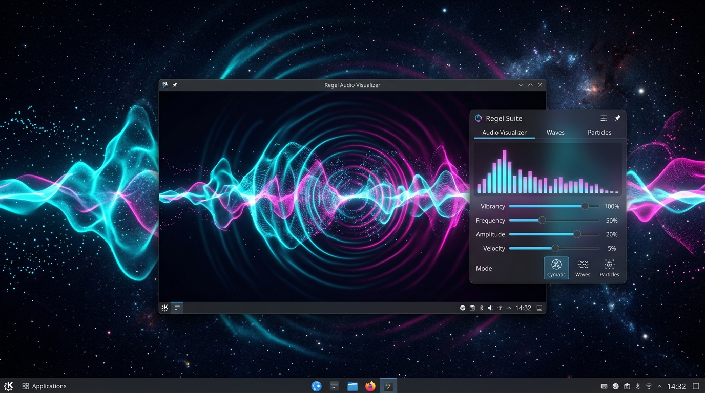
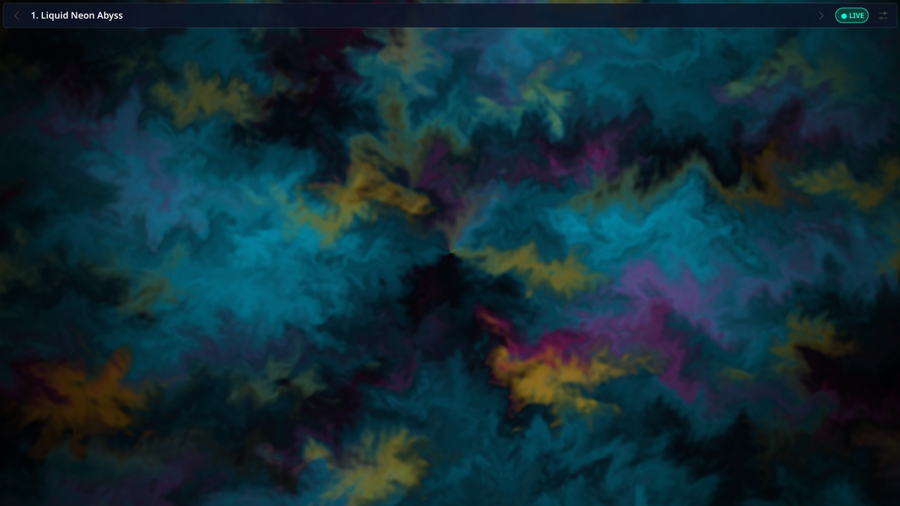
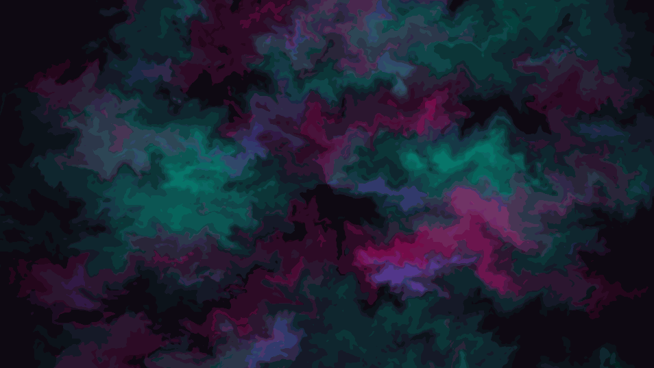
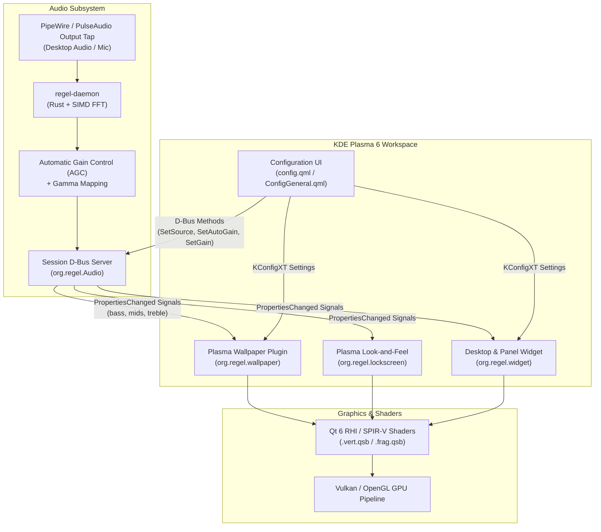
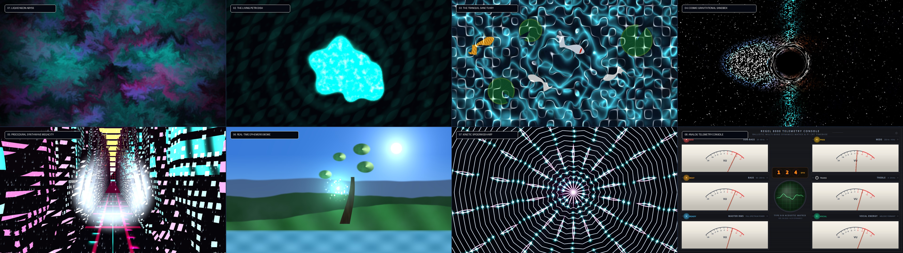
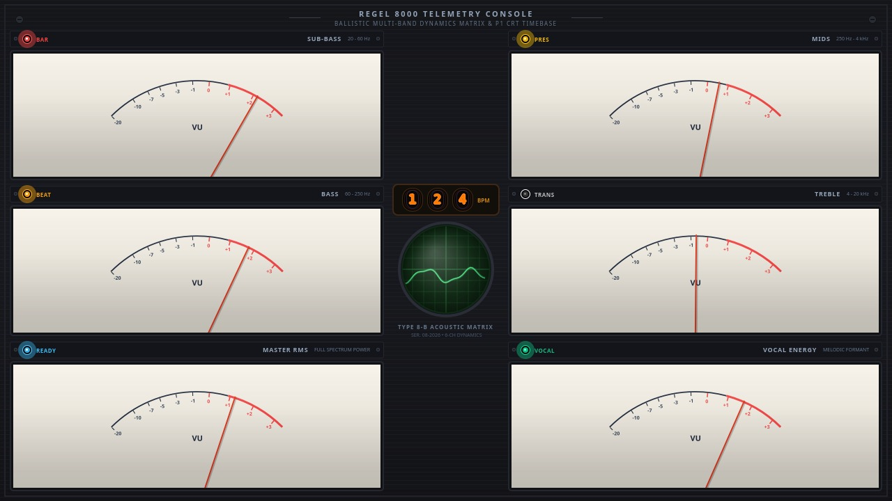

# regel_screensaver

> **Next-Generation Audio-Reactive Interactive Wallpapers & Screensavers for KDE Plasma 6**  
> Running natively on modern Linux (Wayland, PipeWire, Qt 6 RHI, and Safe Rust).

<div align="center">
  
</div>

---

## 🌟 Overview

`regel_screensaver` transforms standard, static desktop backgrounds into living, responsive canvases operating across three distinct domains:

1. **Passive Ambient Desktop Wallpaper**: Runs unobtrusively beneath desktop icons, reacting to cursor sweeps, background music/audio spectrums, microphone transients, and system telemetry.
2. **Interactive Screensaver & Lock Screen**: Takes command of the screen upon idle/lock, unlocking micro-interactions across every step of the authentication lifecycle: typing rhythms, backspace deletions, authentication failure shockwaves, and unlock transitions.
3. **Desktop & Panel Plasma Widget (`org.regel.widget`)**: Can be placed as a resizable visualizer directly on the desktop canvas (for users with static photo wallpapers) or pinned to the Plasma panel as an animated compact audio spectrum meter with an expandable popup.

<div align="center">
  
</div>

---

## ✨ Key Features

- **8 Procedural Aesthetic Archetypes**: From Navier-Stokes fluid dynamics and continuous artificial life (Lenia) to relativistic black hole gravitational lensing and vintage analog telemetry consoles.
- **Versatile Plasma 6 Integrations**:
  - **Wallpaper Containment Plugin (`org.regel.wallpaper`)**: Immersive, full-screen interactive background.
  - **Desktop & Panel Widget / Plasmoid (`org.regel.widget`)**: Freely resizable planar widget on the desktop or animated compact equalizer in the taskbar panel with interactive popup HUD.
  - **Lock Screen Look-and-Feel (`org.regel.lockscreen`)**: Full authentication lifecycle integration.
- **Zero-Configuration Audio Reactivity**:
  - Live PipeWire audio tap (`pw-record` / `parec`) monitoring desktop output ("What You Hear") or microphone.
  - Real-time SIMD FFT spectral decomposition into 6 frequency bands (`sub_bass`, `bass`, `mids`, `treble`, `rms`, `transient`).
  - Automatic Gain Control (AGC) with dynamic headroom normalization.
  - Zero terminal setup required: auto-starts on login via systemd user service and features D-Bus on-demand auto-activation.

<div align="center">
  
</div>
- **Native KDE Plasma 6 Integration**:
  - Pure Qt 6 QML / QtQuick with Vulkan / OpenGL Qt RHI shaders (SPIR-V compiled via `qsb`).
  - Native `org.kde.plasma.workspace.dbus` integration without third-party C++ QML plugins.
  - Full Wayland protocol compliance with cursor hover pass-through for desktop icons.
- **Context-Sensitive Settings & HUD**:
  - Embedded in KDE System Settings &rarr; Wallpaper and Widget Configuration Dialog.
  - Dynamic **Archetype Customization** section that adapts controls to the currently selected concept.
  - 35+ hand-crafted color themes and specialty parameter sliders (rain density, water clarity, gravitational lensing, ephemeris clock sync).
  - Floating on-screen HUD for quick concept switching (`<` and `>`), live audio status, and settings access.
- **Interactive Developer Harness**:
  - Standalone PyQt6 desktop application (`regel-harness`) for real-time parameter tuning, audio stream testing, and lockscreen simulation.
- **Strict Debian Policy Compliance**:
  - 100% offline, reproducible builds via `dpkg-source` and `dpkg-buildpackage`.
  - Passes `lintian -I -E --pedantic` with **0 errors and 0 warnings**.

---

## 🏛️ System Architecture



---

## 🎨 The 8 Aesthetic Archetypes

<div align="center">
  
</div>

| # | Archetype | Aesthetic Theme | Specialized Controls & Color Palettes |
| :-: | :--- | :--- | :--- |
| **01** | [**Liquid Neon Abyss**](docs/01-liquid-neon-abyss.md) | Fluid Dynamics & Cymatics | **Themes**: *Cyber Neon, Bioluminescent Abyssal, Solar Flare / Magma, Quicksilver Metal, Nordic Aurora*.<br/>Navier-Stokes fluid with reactive cymatic wave rings. |
| **02** | [**The Living Petri Dish**](docs/02-living-petri-dish.md) | Lenia Continuous Artificial Life | **Themes**: *Deep Sea Abyssal, Bioluminescent Phytoplankton, Solar Extremophile, Ghost Amoeba, Coral Reef UV*.<br/>**Options**: Circular microscope glass slide vs borderless canvas. |
| **03** | [**The Tranquil Sanctuary**](docs/03-tranquil-koi-sanctuary.md) | Caustic Koi Pond & Boid Flocking | **Themes**: *Spring Sakura, Kyoto Moss Garden, Twilight Fireflies, Autumn Maple, Sumi-e Monochrome*.<br/>**Options**: Water clarity & caustic depth refraction slider. |
| **04** | [**Cosmic Gravitational Sandbox**](docs/04-cosmic-gravitational-sandbox.md) | Relativistic Black Hole & Accretion | **Presets**: *Sagittarius A\*, M87\*, Cygnus X-1, Magnetar SGR 1806-20, Gargantua, Blazar 3C 273*.<br/>**Options**: Gravitational lensing strength, auto-hyperspace cycle. |
| **05** | [**Synthwave Megacity**](docs/05-synthwave-megacity.md) | Procedural Cyberpunk Skyline | **Themes**: *Neo-Tokyo Outrun, Blade Runner 2049, Matrix Phosphor, Syndicate Blood, Retrowave Sunset*.<br/>**Options**: Neon rain downpour density, atmospheric smog density. |
| **06** | [**Real-Time Ephemeris Biome**](docs/06-realtime-ephemeris-biome.md) | Painterly Ghibli Weather Terrarium | **Themes**: *Yakushima Ancient Forest, Sakura Spring Dawn, Autumn Koyo, Alpine Winter, Midnight Bioluminescence*.<br/>**Options**: Weather mode (Clear, Rain, Snow, Mist), real solar clock sync. |
| **07** | [**Kinetic Spiderweb & Resonance Harp**](docs/07-kinetic-spiderweb-harp.md) | Tactile Elastic Lattice | **Themes**: *Moonlit Gossamer, Golden Laser Harp, Bioluminescent Abyssal, Electric Synapse, Frost Crystal Web*.<br/>**Options**: Dewdrop density slider, silk elastic tension slider. |
| **08** | [**The Analog Telemetry Console**](docs/08-analog-telemetry-console.md) | Hex-Meter Ballistic Galvanometer Matrix & Phosphor Timebase | **Themes**: *Vintage Laboratory, Tektronix Phosphor 1974, Nagra IV-S Field Recorder, Soviet Cold-War Bunker, Cyberpunk Deck*.<br/>6 identical ballistic VU galvanometers (ANSI C16.5 2nd-order ODE), external chassis jewel pilot lamps with peak-hold pulse stretchers, P1 phosphor CRT oscilloscope, and Nixie BPM readout. |

<div align="center">
  
</div>

---

## 🚀 Installation & Setup

### Prerequisites

- **OS**: Modern Linux distribution running **KDE Plasma 6** on **Wayland** (Ubuntu 24.04+, Kubuntu 24.10+, Debian 13/Trixie, Fedora 40+, Arch Linux).
- **Sound**: PipeWire (`pipewire`, `wireplumber`, `pipewire-audio-client-libraries`).
- **Qt / QML**: Qt 6.6+ with QtQuick and Kirigami.

### Option A: Install from Debian / Ubuntu Package (`.deb`)

1. **Install the package**:
   ```bash
   sudo dpkg -i dist/regel-screensaver_0.2.0-1_amd64.deb
   sudo apt-get install -f   # Resolves any missing runtime dependencies automatically
   ```

   *(The installer automatically enables and launches `regel-daemon.service` for your user session.)*

2. **Reload Plasma Shell**:
   ```bash
   systemctl --user restart plasma-plasmashell.service
   ```

3. **Enable the Wallpaper**:
   - Right-click your desktop &rarr; **Configure Desktop and Wallpaper...** (or open **System Settings &rarr; Wallpaper**).
   - In the **Wallpaper Type** dropdown, select **Regel Interactive Canvas**.
   - Pick your desired **Aesthetic Concept**, choose a **Color Theme**, and customize the specialty parameters.
   - Click **Apply**!

4. **Add the Widget (Desktop or Panel)**:
   - **Desktop Canvas**: Right-click your desktop &rarr; **Add Widgets...** &rarr; Search for `Regel Audio Visualizer` &rarr; Drag it onto the desktop. You can freely resize it, interact with physics ripples using your mouse, and switch archetypes using the on-hover HUD (`<` and `>`) or middle-click!
   - **Panel / Taskbar**: Right-click your panel &rarr; **Add Widgets...** &rarr; Drag `Regel Audio Visualizer` into the panel. An animated 4-band neon spectrum meter dances to your music in real time. Click the icon to expand into the full popup visualizer.
   - **Configure Widget**: Right-click the widget &rarr; **Configure Regel Audio Visualizer...** to choose themes, flow speed, and audio inputs.

---

## 🛠️ Building from Source

### 1. Install Build Dependencies

On Debian / Ubuntu / Kubuntu:
```bash
sudo apt-get install \
    build-essential \
    debhelper-compat \
    cargo \
    rustc \
    qt6-shadertools \
    qt6-shader-baker \
    libpipewire-0.3-dev \
    libdbus-1-dev \
    pkgconf \
    dpkg-dev \
    lintian \
    python3-pyqt6
```

### 2. Compile Shaders

Compile all GLSL fragment and vertex shaders to Qt RHI SPIR-V binaries (`.qsb`):
```bash
./tools/build-shaders.sh
```

### 3. Build Safe Rust Daemon & Libraries

```bash
cargo build --release --workspace
cargo test --workspace
```

### 4. Build Official Debian Packages

To build the Debian source package (`.orig.tar.gz`, `.debian.tar.xz`, `.dsc`) followed by the binary `.deb` package and execute full Lintian verification:
```bash
./tools/build-deb.sh
```

To build only the pristine Debian source package:
```bash
./tools/package-src.sh
```

All build artifacts will be placed in the `dist/` directory:
- `dist/regel-screensaver_0.2.0-1_amd64.deb`
- `dist/source/regel-screensaver_0.2.0-1.dsc`
- `dist/source/regel-screensaver_0.2.0.orig.tar.gz`

---

## 🧪 Interactive Developer Harness

A standalone PyQt6 testing utility is included to inspect simulations, tune parameters, and test audio pipelines independently of Plasma Shell:

```bash
# Launch via helper script
./tools/run-harness.sh

# Or via installed command
regel-harness
```

**Features in the Harness**:
- Real-time concept switcher (1 through 8).
- Live spectrum analyzer visualizer (sub-bass, bass, mids, treble).
- Sensitivity gain, gamma, and AGC sliders.
- Interactive keyboard and mouse trigger simulator (keystroke velocity, backspace suction, lock/unlock states).
- Hot-reloading of QML visualizers and shaders.

### 📸 Headless Capture & Video Benchmarking Tool

A dedicated offscreen capture utility (`tools/run-capture.sh`) renders and captures authentic, pixel-perfect still images, looping animated GIFs, or MP4 videos directly from Qt 6 RHI GPU shaders without needing an active desktop session (auto-spawns virtual Xvfb display if headless):

```bash
# Capture an authentic high-resolution still of an archetype (e.g. Concept 8)
./tools/run-capture.sh --concept 8 --width 1920 --height 1080 --output assets/screenshots/concept8.png

# Record a smooth looping animated GIF with simulated audio beats
./tools/run-capture.sh --concept 1 --duration 2.0 --fps 30 --output assets/screenshots/fluid-loop.gif

# Record an H.264 MP4 video of the Cosmic Gravitational Sandbox
./tools/run-capture.sh --concept 4 --duration 5.0 --fps 60 --output black_hole.mp4

# Capture the Plasma Desktop Widget with HUD overlay
./tools/run-capture.sh --target widget-desktop --concept 3 --output widget.png

# Generate a composite 2x2 comparison grid of authentic renders
./tools/run-capture.sh --target grid --output assets/screenshots/regel-archetypes-grid.jpg
```

---

## 📡 D-Bus IPC Protocol Reference

`regel-daemon` publishes the `org.regel.Audio` service on the D-Bus session bus:

- **Bus Name**: `org.regel.Audio`
- **Object Path**: `/org/regel/Audio`
- **Interface**: `org.regel.Audio`

### Properties (`org.freedesktop.DBus.Properties`)

| Property | Type | Access | Description |
| :--- | :---: | :---: | :--- |
| `sub_bass` | `double` | Read | Sub-bass energy (20 Hz – 60 Hz), normalized `0.0 – 1.0` |
| `bass` | `double` | Read | Bass / Kick energy (60 Hz – 250 Hz), normalized `0.0 – 1.0` |
| `mids` | `double` | Read | Midrange / Vocal energy (250 Hz – 2 kHz), normalized `0.0 – 1.0` |
| `treble` | `double` | Read | Treble / High-hat energy (2 kHz – 16 kHz), normalized `0.0 – 1.0` |
| `rms` | `double` | Read | Root-mean-square overall volume, normalized `0.0 – 1.0` |
| `transient` | `bool` | Read | Detected sudden acoustic onset / drum hit / clap |
| `bpm` | `double` | Read | Estimated tempo (BPM) from rhythm tracking |
| `beat` | `bool` | Read | Beat event onset impulse flag |
| `downbeat` | `bool` | Read | Measure downbeat impulse flag (measure bar start) |
| `beat_phase` | `double` | Read | Continuous phase of current beat (`0.0 – 1.0`) |
| `is_vocal` | `bool` | Read | Vocal activity / singing presence detected |
| `vocal_energy` | `double` | Read | Normalized singing voice activity energy (`0.0 – 1.0`) |
| `source` | `string` | Read | Active capture source (`"monitor"` or `"mic"`) |
| `gain` | `double` | Read | Manual gain multiplier (`1.0 – 20.0`) |
| `auto_gain` | `bool` | Read | Whether Automatic Gain Control (AGC) is active |

### Signals

| Signal | Arguments | Description |
| :--- | :--- | :--- |
| `Beat(uint64 timestamp_us, double bpm, uint32 beat_index, bool is_downbeat)` | `timestamp_us`, `bpm`, `beat_index`, `is_downbeat` | Dispatched synchronously with acoustic downbeats and beat onsets for sub-frame micro-choreography. |

### Methods

| Method | Arguments | Description |
| :--- | :--- | :--- |
| `SetSource(string source)` | `source`: `"monitor"` or `"mic"` | Dynamically re-targets the PipeWire audio tap without restarting the daemon. |
| `SetGain(double gain)` | `gain`: `0.1` to `20.0` | Adjusts manual sensitivity multiplier. |
| `SetAutoGain(bool auto_gain)` | `auto_gain`: `true` or `false` | Enables/disables real-time automatic gain control normalization. |

---

## 📜 Project Structure

```
regel_screensaver/
├── assets/                    # Systemd service, D-Bus service, desktop icons
├── crates/
│   ├── regel-audio/           # PipeWire DSP, rustfft SIMD, and AGC engine
│   ├── regel-daemon/          # Background daemon with C-based session D-Bus server
│   └── regel-engine/          # High-performance physics and state engine
├── debian/                    # Official Debian packaging rules, control, and metadata
├── docs/                      # Architectural specs & concept design blueprints
│   ├── 08-analog-telemetry-console.md  # Concept 8: Analog Telemetry Console spec
│   └── 09-neural-audio-subsystem.md    # Neural rhythm & singing voice subsystem spec
├── engine/                    # Shared QtQuick QML components & shaders
│   ├── AnalogTelemetryConsole.qml     # Authentic ballistic VU & phosphor CRT console
│   ├── Palettes.qml           # Centralized color theme palette definitions
│   └── shaders/               # GLSL vertex/fragment shaders (.qsb SPIR-V binaries)
├── lockscreen/                # KDE Look-and-Feel lockscreen theme
├── plasmoid/                  # KDE Plasma 6 Desktop & Panel Widget (org.regel.widget)
│   ├── metadata.json          # Plasma applet metadata
│   └── contents/
│       ├── config/            # KConfigXT schema & ConfigModel definition
│       └── ui/
│           ├── CompactRepresentation.qml  # Animated neon spectrum meter for panel
│           ├── ConfigGeneral.qml          # Full widget configuration dialog
│           ├── FullRepresentation.qml     # Visualizer canvas with interactive HUD
│           └── main.qml                   # PlasmoidItem entrypoint & D-Bus client
├── tools/                     # Build scripts and interactive harness
│   ├── build-deb.sh           # Debian binary package builder (.deb)
│   ├── build-shaders.sh       # Shader compilation script (qsb)
│   ├── capture.py             # Headless offscreen GPU capture & benchmarking engine
│   ├── package-src.sh         # Debian source package builder (.dsc + tarball)
│   ├── run-capture.sh         # Headless capture launcher (still, GIF, MP4, grid)
│   └── harness/               # PyQt6 interactive testing harness
└── wallpaper/                 # KDE Plasma 6 wallpaper containment plugin
    └── contents/
        ├── config/main.xml    # KConfigXT schema for wallpaper settings
        └── ui/
            ├── config.qml     # Context-sensitive wallpaper configuration UI
            └── main.qml       # Wallpaper entrypoint & D-Bus IPC client
```

---

## 📄 License

Licensed under GPL-2.0-or-later. See the project source headers for license notices.
