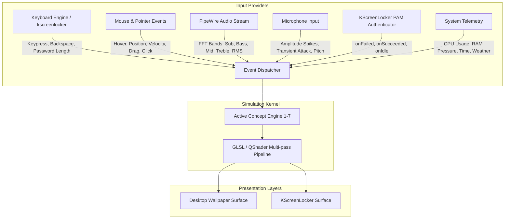
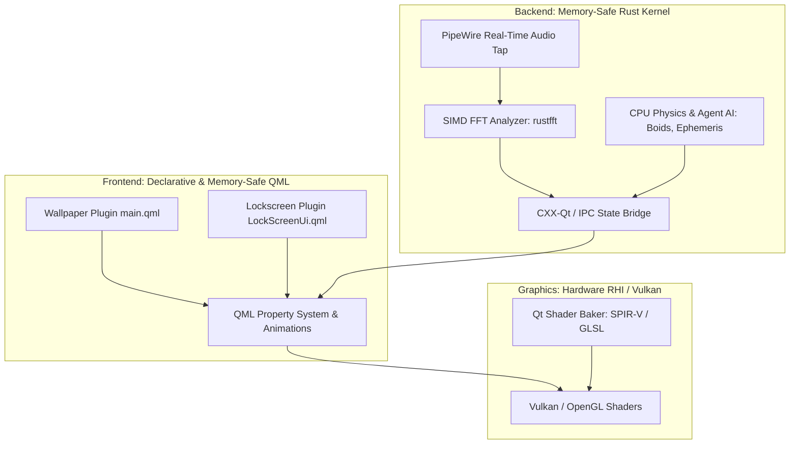
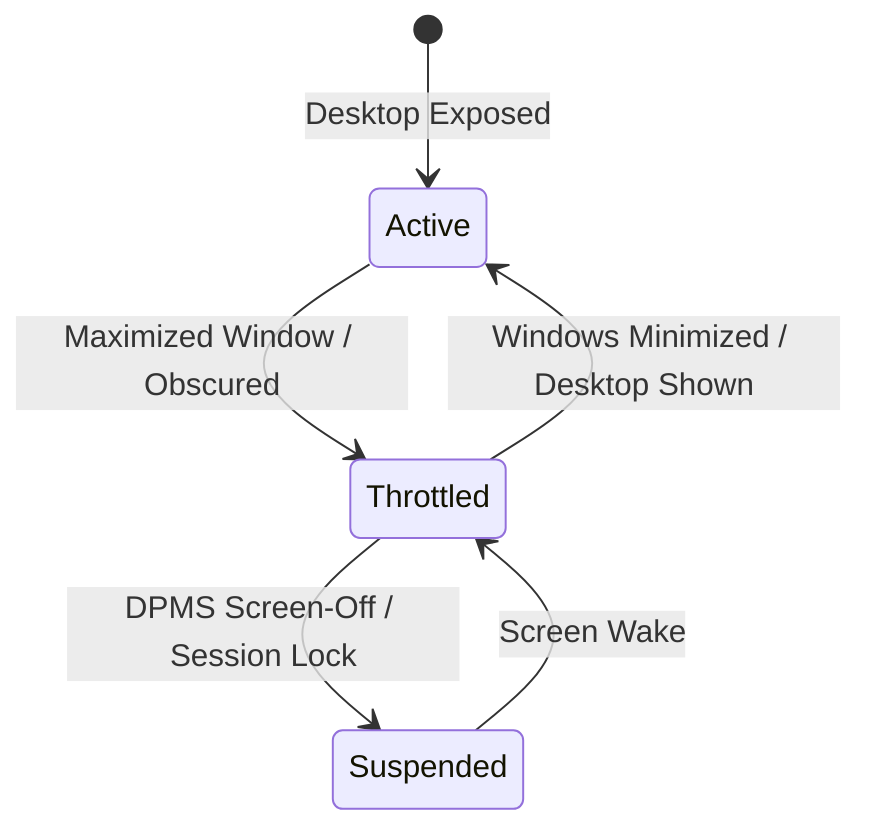

# regel_screensaver: Architecture & System Overview

## 1. Vision & Purpose
`regel_screensaver` is a next-generation interactive visual canvas designed for **KDE Plasma 6** (running on **Wayland** with **PipeWire**). 

Instead of static image wallpapers or basic looped video backgrounds, `regel_screensaver` operates as a **dual-mode real-time interactive engine**:
1. **Desktop Wallpaper Mode**: Runs as a native KDE Plasma 6 wallpaper plugin (`org.kde.plasma.wallpapers`), operating smoothly behind desktop icons with low resource footprint, reacting to cursor movement, ambient audio, and system telemetry.
2. **Screensaver & Lockscreen Mode**: Integrates into KDE Plasma's `kscreenlocker` architecture, seizing the full screen and receiving rich input events: real-time keystrokes, typing rhythm, backspaces, and authentication lifecycle states (success, failure, idle timeouts).

---

## 2. Core Architecture

```
regel_screensaver/
├── docs/                               # High-Level Architecture & Concept Designs
│   ├── 00-architecture-overview.md     # System architecture, event pipeline, & APIs
│   ├── 01-liquid-neon-abyss.md         # Concept 1: Fluid Dynamics & Chromatic Cymatics
│   ├── 02-living-petri-dish.md         # Concept 2: Lenia & Continuous Artificial Life
│   ├── 03-tranquil-koi-sanctuary.md    # Concept 3: Caustic Koi Pond & Boid Ecosystem
│   ├── 04-cosmic-gravitational-sandbox.md # Concept 4: Black Hole & Accretion Dust
│   ├── 05-synthwave-megacity.md        # Concept 5: Procedural Synthwave Megacity
│   ├── 06-realtime-ephemeris-biome.md  # Concept 6: Real-Time Ephemeris Biome
│   └── 07-kinetic-spiderweb-harp.md    # Concept 7: Kinetic Spiderweb & Resonance Harp
├── engine/                             # Core Rendering & Simulation Engine
│   ├── shaders/                        # High-performance GLSL / QSB shaders
│   ├── simulation/                     # Physics, automata, and particle models
│   ├── audio/                          # PipeWire FFT & audio transient analyzer
│   └── input/                          # Unified input abstraction (Keyboard, Mouse, Mic)
├── wallpaper/                          # KDE Plasma 6 Wallpaper Plugin Packaging
│   ├── metadata.json                   # Plasma 6 wallpaper package definition
│   └── contents/ui/main.qml            # Wallpaper root component
└── lockscreen/                         # KDE Plasma 6 Look-and-Feel Screenlocker
    ├── metadata.json                   # kscreenlocker integration
    └── contents/lockscreen/            # LockScreenUi and Authenticator hooks
```

---

## 3. The Unified Event Pipeline

Every concept connects to a standardized set of event channels:



### Event Specifications

1. **Authentication & Lifecycle Events**:
   * `onLock`: Desktop transitions into locked state.
   * `onIdle(duration)`: Time elapsed without user interaction.
   * `onWake`: First mouse movement or keypress after idle.
   * `onKeyStroke(key, count)`: A character is entered into the password field.
   * `onBackspace(count)`: Characters are removed from the password field.
   * `onAuthFailed`: PAM authentication fails (`authenticator.onFailed`).
   * `onAuthSucceeded`: PAM authentication succeeds (`authenticator.onSucceeded`).
   * `onUnlock`: Session resumes back to desktop.

2. **Pointer & Cursor Events**:
   * `cursorPosition`: Normalized `(x, y)` coordinate on screen.
   * `cursorVelocity`: Movement delta vector `(dx/dt, dy/dt)`.
   * `cursorDown / cursorUp`: Click and drag state.

3. **Audio Spectrum Events (PipeWire Capture)**:
   * `subBass` (20–60 Hz): Energy for massive shockwaves and gravity wells.
   * `bass` (60–250 Hz): Rhythm pulses, dye jets, and building height modulations.
   * `mids` (250–4000 Hz): Vocal and melodic turbulence, organism speed.
   * `treble` (4000–20000 Hz): Sparkles, dew drops, laser flickers, rain mist.
   * `transientAttack`: Sudden percussive burst detection (claps, snare drums).

---

## 4. Technology Stack in KDE Plasma 6
* **Windowing & Compositor**: Wayland (`kwin_wayland`) using native layer-shell protocols.
* **UI Framework**: Qt 6 / QtQuick 6 / QML.
* **Graphics API**: Vulkan / OpenGL via Qt Shader Tools (`qsb` SPIR-V cross-compilation) and `ShaderEffect` multi-pass framebuffers.
* **Audio Layer**: PipeWire native node or lightweight FFT pipe (`pw-cat` / `cava` backend) delivering low-latency frequency analysis without root permissions.

---

## 5. Language & Framework Decision: Rust + QML / Qt 6 RHI

To eliminate the memory safety hazards and vulnerability surface of traditional C++ Plasma extensions while maintaining absolute 60–144 FPS real-time performance, the project adopts a **hybrid Rust + QML** architecture:



### Division of Responsibilities

1. **Frontend Presentation & Shell Hooks (QML / QtQuick 6)**:
   * Native integration with Plasma 6 wallpaper containment and `kscreenlocker`.
   * Declarative signal handling for `authenticator.onFailed`, `authenticator.onSucceeded`, and typing keystroke events.
   * Garbage-collected, memory-safe execution with zero native pointer hazards.

2. **Core Backend & Systems Plumbing (Rust)**:
   * **Memory Safety & Determinism**: Zero garbage-collection pauses, eliminating frame drops and micro-stutters during high-refresh-rate rendering.
   * **PipeWire Audio Graph**: Connects to the user's PipeWire audio server using safe Rust bindings to extract low-latency raw audio buffers.
   * **SIMD Frequency Analysis**: Employs `rustfft` (with AVX2/NEON vectorization) to compute real-time spectral bands (Sub-bass, Bass, Mids, Treble, and transient attacks) with minimal CPU usage.
   * **Physics & AI Compute**: Runs CPU-bound agent calculations (such as Reynolds Boid flocking, celestial ephemeris calculations, and weather feed ingestion) with thread-safe concurrency.

3. **Graphics Engine (Qt 6 RHI & Vulkan-style GLSL)**:
   * Multi-pass compute and fragment shaders written in Vulkan GLSL and compiled via `qsb` (Qt Shader Baker) into unified SPIR-V packages.
   * Leverages GPU hardware acceleration for Eulerian fluid advection, N-body particle rendering, and raymarched distance fields.

---

## 6. Wayland Security & Input Isolation Boundary

A core architectural principle of Wayland is **strict client isolation**: background windows cannot eavesdrop on global pointer coordinates or keystrokes belonging to other applications.

* **In Lockscreen / Screensaver Mode**:
  * `kscreenlocker` establishes an exclusive session lock (via Wayland's `ext-session-lock-v1`).
  * The locker surface possesses **100% exclusive input focus**. Every keystroke, backspace, and cursor motion is routed directly into `LockScreenUi.qml` with zero security compromises.
* **In Wallpaper Mode**:
  * The wallpaper resides on the `zwlr_layer_shell_v1` background layer.
  * It receives pointer events (`onPositionChanged`, `onPressed`) **only when the cursor directly hovers over the exposed desktop canvas**.
  * When other application windows have focus, wallpaper mode does not capture keystrokes (by design, adhering to Wayland security). It continues animating smoothly using ambient audio (PipeWire), system telemetry, and internal simulation momentum.

---

## 7. Power Management & Occlusion Throttling

Running high-fidelity simulations at 60–144 FPS must not drain laptop batteries or waste GPU cycles when the desktop is hidden. The architecture implements strict lifecycle throttling:



1. **Occlusion Detection (`onObscured` / `onExposed`)**:
   * Plasma’s containment exposes window visibility signals.
   * When the desktop is completely obscured by maximized or fullscreen windows (e.g., games or video playback), `ShaderEffect.visible = false` stops rendering, and the QML timer pauses frame requests.
2. **DPMS Screen-Off & Suspend (`onDpmsOff`)**:
   * Listens to system power management events via `org.freedesktop.ScreenSaver` and `logind`.
   * **GPU Pipeline**: Halts all draw calls and buffer swaps immediately.
   * **Rust Engine**: Suspends the PipeWire stream processing thread and parks the simulation worker loop using condition variables, dropping CPU utilization to 0.0%.

---

## 8. Multi-Monitor Topology & Coordination

KDE Plasma instantiates an independent `main.qml` instance for each connected display (`Screen.name`, resolution, DPI scale factor). The Rust backend supports two configurable coordination strategies:

1. **Independent Instance Mode (Default)**:
   * Each monitor hosts its own self-contained simulation kernel and aspect-ratio-corrected framebuffer.
   * Maximizes performance and avoids coordinate stretching across displays with mismatched resolutions or refresh rates (e.g., 4K 60Hz paired with 1440p 144Hz).
2. **Unified Spanned Canvas Mode**:
   * The Rust backend maintains a single global coordinate space encompassing all physical monitor bounds.
   * The QML frontend on each monitor renders its respective viewport slice $(x, y, w, h)$ of the shared simulation field, enabling fluid swirls and celestial bodies to seamlessly drift across monitor borders.

---

## 9. Audio Silence & Ambient Energy Floor

To guarantee that visualizers remain visually mesmerizing even when no music or audio is playing:

* The PipeWire audio analyzer enforces a mathematical **ambient baseline energy floor** ($E_{\text{floor}} \ge 0.05$).
* When system audio amplitude drops below the noise gate threshold, the simulation smoothly interpolates from audio-driven turbulence into **procedural Perlin/curl noise drifts** and autonomous breathing cycles.
* The canvas never freezes into a dead static image when music stops.


