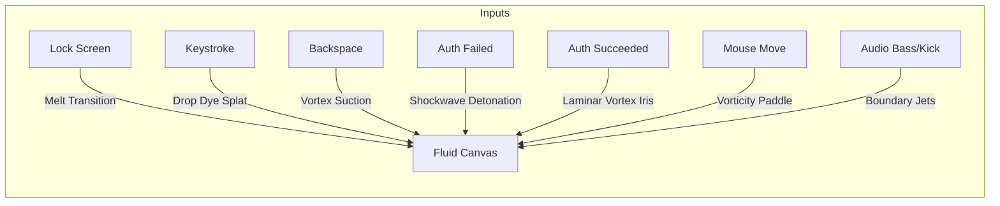

# Concept 1: Liquid Neon Abyss (Fluid Dynamics & Chromatic Cymatics)

## 1. Aesthetic Vision
A real-time, GPU-accelerated **Navier-Stokes Eulerian fluid simulation** where the desktop behaves like a deep, viscous pool of black liquid obsidian. Radiantly luminous dyes (electric cyan, hot magenta, solar amber, and ultraviolet) swirl, mix, and diffuse across the screen. 

The fluid exhibits dynamic surface tension, curl turbulence, and optical bloom with subtle chromatic aberration around high-velocity shockwaves.

---

## 2. Event-to-Effect Mapping

### Complete Event Matrix

| Event | Visual & Simulation Reaction | Audio / Haptic Metaphor |
| :--- | :--- | :--- |
| **Lock Screen Entry (`onLock`)** | The current desktop appears to liquify and dissolve downward into deep obsidian black as viscous ink rolls across the screen. | Heavy liquid immersion, low-pass filter transition. |
| **Deep Idle / Sleep (`onIdle`)** | Fluid velocity gradually dampens. The dye settles into ethereal, softly glowing filaments that drift with ultra-low Brownian motion. | Deep rhythmic "breathing" ambient glow. |
| **Wake / Touch (`onWake`)** | A gentle circular ripple emanates from the screen center, lighting up dormant dye particles with soft phosphor trails. | Soft acoustic water droplet ping. |
| **Password Keystroke (`onKeyStroke`)** | **Dye Drop Injection**: Each keystroke drops a splash of radiant dye (alternating between complementary neon tones) directly beneath the cursor or password box. Rapid typing forms a swirling, vibrant vortex chain. | Sharp, clean liquid droplet plink with pitch scaling to typing speed. |
| **Backspace / Delete (`onBackspace`)** | **Suction Sinkhole**: Generates a momentary negative pressure singularity at the injection point, pulling nearby dye spirals inward into an abyss. | Backwards fluid whoosh / cavitation collapse. |
| **Wrong Password (`onAuthFailed`)** | **Cavitation Shockwave Detonation**: A massive explosive burst of deep crimson dye detonates from the center. High-velocity shockwaves tear through the fluid grid, shattering smooth laminar flows into chaotic fractal eddies before dissipating. | Heavy sub-bass thud accompanied by acoustic cavitation snap. |
| **Correct Password (`onAuthSucceeded`)** | **Laminar Vortex Iris**: Fluid accelerates into a hyper-smooth centrifugal vortex at the center, spinning rapidly outward and clearing an opening that reveals the unlocked desktop. | Ascending liquid resonant chime / swirl to silence. |
| **Mouse Hover & Drag** | The cursor acts as a paddle and heating element. Fast drags inject velocity vectors creating dual Karman vortex streets; holding still creates thermal convection plumes that rise. | Smooth viscous drag friction. |
| **Audio Beat (Kick / Sub-bass)** | Perimeter velocity injectors fire high-speed pulses of luminescent dye inward towards the screen center on every kick drum transient. | Direct physical coupling with sound pressure level. |
| **Audio Treble & Mids** | Modulates fluid vorticity confinement and viscosity: high frequencies create fine wispy filament swirls, while mid frequencies churn fluid eddies. | Surface shimmer and micro-droplet splatter. |
| **Microphone Input** | Sudden loud sounds (speech, claps) trigger acoustic standing waves (Faraday waves / cymatics) that form geometric ripple interference patterns across the pool. | Acoustic resonance across liquid surface. |

---

## 3. Technical Simulation Blueprint

### Simulation Pipeline (Multi-Pass GLSL Framebuffers)
1. **Advection Pass**: Advects velocity and dye density fields across the grid using semi-Lagrangian back-tracing:
   $$\mathbf{u}(\mathbf{x}, t + \Delta t) = \mathbf{u}(\mathbf{x} - \mathbf{u}(\mathbf{x}, t)\Delta t, t)$$
2. **Vorticity Confinement Pass**: Calculates the curl $\nabla \times \mathbf{u}$ and applies anti-dissipative rotational forces to preserve micro-swirls and energetic eddies.
3. **Divergence Pass**: Computes velocity field divergence $\nabla \cdot \mathbf{u}$ to enforce incompressibility.
4. **Pressure Poisson Solver**: Runs 20–40 Jacobi iterations to compute the pressure field $p$:
   $$\nabla^2 p = \nabla \cdot \mathbf{u}$$
5. **Gradient Subtraction Pass**: Projects velocity to be divergence-free:
   $$\mathbf{u}_{\text{new}} = \mathbf{u} - \nabla p$$
6. **Composite & Shading Pass**:
   * Blends dye density with high dynamic range (HDR) color curves.
   * Applies screen-space light refraction and specular highlights based on dye density gradients (normal mapping).
   * Fast dual-filtering bloom pass for intense neon radiation.

### Key Tuning Parameters
* **Grid Resolution**: $512 \times 512$ or $1024 \times 1024$ simulation texture mapped to 4K viewport.
* **Viscosity**: Dynamic ($0.001$ to $0.05$ based on audio tempo).
* **Dye Dissipation**: $0.985$ per second (leaves hypnotic persistent trails without cluttering the screen).
* **Vorticity Strength**: $25.0$.
