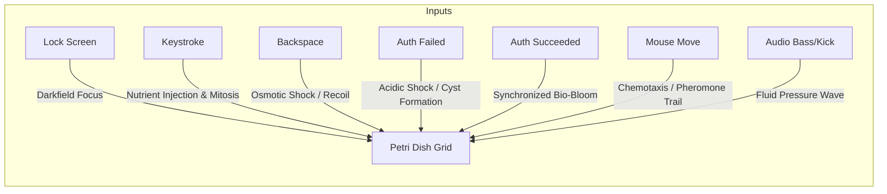

# Concept 2: The Living Petri Dish (Lenia & Continuous Artificial Life)

## 1. Aesthetic Vision
A real-time simulation of **continuous cellular automata** (based on Bert Chan's *Lenia* and *Continuous Life* mathematical models). The screen becomes the slide of a high-power darkfield optical microscope.

Instead of blocky pixel cells, the desktop hosts smooth, organic, self-organizing digital lifeforms: undulating "alien amoebas", pulsating soliton gliders, rotating multi-lobed crawlers, and delicate membrane colonies. Each creature is translucent with iridescent interior organelles that glow with bioluminescent fluorescence (deep sea cyan, emerald, opalescent pearl, and bioluminescent amber).

---

## 2. Event-to-Effect Mapping

### Complete Event Matrix

| Event | Visual & Simulation Reaction | Audio / Haptic Metaphor |
| :--- | :--- | :--- |
| **Lock Screen Entry (`onLock`)** | The screen dims into darkfield illumination; microscopic aperture blades open; dormant micro-organisms awaken and drift toward the center. | Low-frequency hum of an electric microscope lamp, soft liquid stir. |
| **Deep Idle / Sleep (`onIdle`)** | Creatures synchronize into slow, serene orbital dances; solitary wanderers cluster into intricate, lace-like colonies and enter metabolic stasis. | Rhythmic, slow respiratory bioluminescent pulse. |
| **Wake / Touch (`onWake`)** | A subtle bio-electric potential passes across the medium, causing organisms to extend sensitive pseudopods and flutter cilia. | Soft, high-frequency bio-acoustic shimmer. |
| **Password Keystroke (`onKeyStroke`)** | **Nutrient Spark & Mitosis**: Each keypress drops a glowing micro-nutrient droplet directly under the cursor. Organisms surge forward in excitement. Rapid typing injects enough metabolic energy to trigger **mitosis** (creatures divide in two). | Crisp organic pop / bubble chirp scaling with typing cadence. |
| **Backspace / Delete (`onBackspace`)** | **Osmotic Pulse**: Generates a brief reverse-osmosis shockwave; organisms contract their membranes inward and scatter backward in defensive retreat. | Sharp micro-retraction snap. |
| **Wrong Password (`onAuthFailed`)** | **Acidic Toxicity Wave**: A harsh crimson/amber chemical flash sweeps across the petri dish. Organisms convulse and curl into dense defensive spherical cysts, scattering wildly away from the password box. | Harsh discordant acoustic chime / electrical static buzz. |
| **Correct Password (`onAuthSucceeded`)** | **Bioluminescent Colony Bloom**: Every organism achieves instant chemical synchronization, emitting a blinding burst of emerald and electric-cyan phosphorescence that floodlights the screen into the desktop. | Radiant ascending choral harmonic crescendo. |
| **Mouse Hover & Drag** | The cursor leaves a radiant **pheromone trail** (chemotaxis). Hungry organisms track the trail like curious deep-sea pets. Fast jerky cursor movements create turbulence that tosses small organisms. | Gentle fluid drag against soft organic bodies. |
| **Audio Beat (Kick / Sub-bass)** | Acoustic shockwaves physically displace the liquid substrate, causing organisms to flex and compress rhythmically with the beat. | Physical diaphragm pulse. |
| **Audio Treble & Mids** | High frequencies stimulate internal organelle glow rates; harmonics cause the cilia fringe of large amoebae to vibrate. | Delicate harmonic shimmer. |
| **Microphone Input** | Speaking into the mic sets up standing acoustic levitation nodes (Chladni nodes); organisms gather along geometric resonance nodal lines in response to your voice. | Direct voice-to-structure resonance. |

---

## 3. Technical Simulation Blueprint

### Continuous Cellular Automata Kernel
Lenia generalizes Conway's Game of Life to continuous space, continuous time, and continuous states:

1. **State Space**: $A(x, y) \in [0, 1]$ stored in floating-point 2D textures.
2. **Convolution Kernel**: A multi-ring concentric neighborhood kernel $K$:
   $$K(r) = \exp\left(-\frac{(r - r_0)^2}{2\sigma_r^2}\right)$$
   Evaluated using either separable spatial convolution or 2D FFT in GLSL.
3. **Growth Function**: The potential field $U = K * A$ feeds into a bell-shaped growth function $G(U)$:
   $$G(u) = 2 \exp\left(-\frac{(u - \mu)^2}{2\sigma^2}\right) - 1$$
4. **Integration Step**:
   $$A^{t + \Delta t} = \text{clamp}\left(A^t + \Delta t \cdot G(K * A^t), 0, 1\right)$$

### Shading & Optical Render Pass
* **Phase-Contrast / Darkfield Optical Model**: Derives surface normals from field gradient $\nabla A = \left(\frac{\partial A}{\partial x}, \frac{\partial A}{\partial y}\right)$ to calculate specular highlights on gelatinous membranes.
* **Organelle Sub-Layer**: Secondary noise pass modulated by high $A$ values renders vibrating interior nuclei and vacuoles.
* **Fluorescence Emission**: Non-linear HDR color mapping curves with soft bloom pass.
