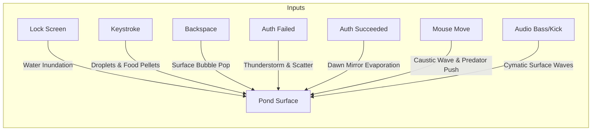

# Concept 3: The Tranquil Sanctuary (Caustic Koi Pond & Boid Ecosystem)

## 1. Aesthetic Vision
A serene Japanese garden koi pond viewed from directly overhead. 

The water is crystal clear, casting dancing **sunlight caustics** onto smooth river pebbles, weathered granite slabs, and submerged moss. Translucent lily pads float on the surface, casting soft drop-shadows. Beneath the surface swims a school of gracefully animated Nishikigoi (Kohaku, Taisho Sanke, and ethereal midnight Ghost Koi) whose bodies undulate with procedural spine physics.

---

## 2. Event-to-Effect Mapping

### Complete Event Matrix

| Event | Visual & Simulation Reaction | Audio / Haptic Metaphor |
| :--- | :--- | :--- |
| **Lock Screen Entry (`onLock`)** | Clear water washes over the screen from the top, refracting the desktop image until it dissolves into tranquil pond bottom stones. | Soothing immersion of flowing water, distant garden wind-chime. |
| **Deep Idle / Sleep (`onIdle`)** | Koi enter relaxed, rhythmic cruising orbits. Twilight sets in; glowing night fireflies drift above the water, casting reflections on the ripples. | Gentle water lap, distant cicada ambience. |
| **Wake / Touch (`onWake`)** | A single golden maple leaf falls from the top edge onto the pond surface, radiating clean concentric ripple waves. | Crisp aquatic drip note. |
| **Password Keystroke (`onKeyStroke`)** | **Raindrop & Food Pellet**: Each keypress drops a glowing raindrop that creates a crisp circular ripple and sinks as a small glowing food pellet. Fast typing creates a delightful summer rain shower; koi excitedly swarm to nibble the pellets. | Gentle acoustic waterdrop plink scaling pentatonically with keystrokes. |
| **Backspace / Delete (`onBackspace`)** | **Air Bubble Burst**: An air bubble rises from the depths under the cursor and pops with an acoustic surface disturbance, pushing nearby fish slightly outward. | Distinct soft water bubble pop. |
| **Wrong Password (`onAuthFailed`)** | **Thunderstorm Squall**: Sudden lightning flashes illuminate the pond floor; heavy rain pelts the surface with turbulent chaotic ripples. Startled koi panic and dart away at top speed to hide under lily pads and stones. | Sudden distant thunder roll and heavy rain rush. |
| **Correct Password (`onAuthSucceeded`)** | **Dawn Evaporation**: The water surface calms into a perfect, glass-smooth mirror reflecting golden sunrise light. The water gently evaporates into a warm morning mist, unveiling the restored desktop. | Warm, resonant singing-bowl chime fading into clarity. |
| **Mouse Hover & Drag** | Cursor creates dynamic surface ripples that distort caustics on the bottom. Moving slowly allows koi to approach curiously; moving quickly treats the cursor as a **predator**, causing fish to scatter using Reynolds flocking. | Smooth fluid drag, soft water displacement. |
| **Audio Beat (Kick / Sub-bass)** | Produces 2D standing waves (cymatics) on the water surface; heavy bass notes cause koi to flick their tail fins with extra thrust. | Physical bass resonance through water volume. |
| **Audio Treble & Mids** | High notes cause miniature surface sparkles and light caustic shimmers across the riverbed. | Crystalline water chime shimmer. |
| **Microphone Input** | Speaking into the mic generates gentle continuous concentric waves radiating from the center. A loud shout or clap startles the koi into diving into deeper shadow. | Direct voice-to-water wave propagation. |

---

## 3. Technical Simulation Blueprint

### 1. Shallow Water Wave Equation (Heightfield Buffer)
The water surface is modeled as a 2D heightfield $h(x, y)$ running in a ping-pong framebuffer:
$$h^{t+1}(x, y) = 2h^t(x, y) - h^{t-1}(x, y) + c^2 \nabla^2 h^t(x, y) - d \cdot (h^t(x, y) - h^{t-1}(x, y))$$
* $c$: Wave propagation speed.
* $d$: Fluid damping factor (ensures ripples dissipate naturally).
* Normal vectors are computed from the height gradient $\mathbf{n} = \text{normalize}(-\frac{\partial h}{\partial x}, -\frac{\partial h}{\partial y}, 1.0)$.

### 2. Real-Time Light Caustic Raymarching
* Light rays passing through the wavy surface bend according to Snell's Law:
  $$\mathbf{r}_{\text{refr}} = \text{refract}(\mathbf{l}_{\text{sun}}, \mathbf{n}, \eta_{\text{water}})$$
* The refracted rays intersect the textured bottom plane ($z = -D$). Areas where refracted rays converge are accumulated into a caustic brightness map, producing vivid, dancing light networks on the stones.

### 3. Reynolds Boid Multi-Agent Fish AI
Each koi agent $i$ updates its acceleration based on classical flocking plus interactive behaviors:
$$\mathbf{a}_i = w_s \mathbf{F}_{\text{separation}} + w_a \mathbf{F}_{\text{alignment}} + w_c \mathbf{F}_{\text{cohesion}} + w_p \mathbf{F}_{\text{predator\_avoid}} + w_f \mathbf{F}_{\text{food\_seek}}$$
* **Procedural Body Undulation**: The koi mesh consists of 8 skeletal segments. Segment 0 follows the boid velocity heading; segments $1 \dots 7$ follow along the movement spline with phase-delayed sine wave lateral sway:
  $$\theta_k(t) = A_k \sin(\omega t - k \cdot \phi)$$

### 4. Floating Lily Pad Dynamics & Acoustic Resonance
* **Harmonic Ambient Current Drift & Anti-Overlap Physics**:
  5 floating lily pads (`Nymphaeaceae`) drift with gentle water currents while anchored to margin zones. Overlapping is prevented via pairwise soft elastic repulsion ($k_{\text{spring}} = 5.5$) and velocity damping ($c_{\text{damp}} = 0.88$). Bumping between leaves imparts a subtle rotational torque and contact ripple.
* **Sound-Driven Membrane Resonance & Rim Waves**:
  * On audio downbeats, lily pads expand by $+8\%$ with an exponential spring decay.
  * Discrete audio pulses and physical leaf collisions generate outward circular wave packets radiating from the leaf outer rims into the water heightfield:
    $$\Delta h = \sin(d_{\text{rim}} \cdot 36.0 - \omega \tau) \cdot \exp(-d_{\text{rim}} \cdot 10.0) \cdot A \cdot 0.005$$

### 5. 12-Variety Nishikigoi Phenotypic Taxonomy & Migration Pool
The pond maintains an active density of 5 koi slots with an open lifecycle:
* **Taxonomic Varieties**:
  1. **Kohaku**: Pure white body with bold scarlet red (*Hi*) stepped plates.
  2. **Taisho Sanke**: White base with scarlet plates and sumi lacquer black dots.
  3. **Showa Sanshoku**: Heavy ink-black base with wrapping scarlet and white lightning bands.
  4. **Yamabuki Ogon**: Radiant metallic solid gold with scale specular glint.
  5. **Tancho**: Silver-white body with a solitary crimson crown sun spot on the head.
  6. **Asagi**: Indigo-blue reticulated net-pattern dorsal scales with vermilion flanks.
  7. **Shusui**: Baby-blue porcelain mirror skin with dark indigo dorsal zipper scales.
  8. **Ki Utsuri**: Jet-black lacquer body with bright amber-yellow tiger markings.
  9. **Gin Matsuba**: Metallic platinum silver with dark pinecone scale centers.
  10. **Chagoi / Ochiba**: Earthy olive-brown tea and autumn-leaf tones.
  11. **Karasugoi (Midnight Ghost Koi)**: Crow-black shadow silhouette with glowing fin margins.
  12. **Butterfly / Hirenaga Koi**: Flowing diaphanous veil fins ($2.2\times$ length) with iridescent pearlescence.
* **Autonomous Migration Lifecycle**:
  Fish cruise for 25–55 seconds before steering toward an offscreen exit gate. Near pond margins, a depth factor $z \in [0.0, 1.0]$ attenuates drop shadows, blends the body into the water absorption tint, and casts surface caustics over their backs, creating the visual effect of gliding into deep water under the banks. Slots are recycled off-screen with freshly generated varieties.
