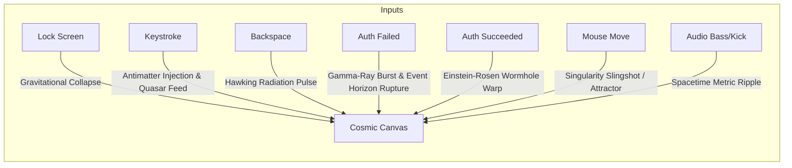

# Concept 4: Cosmic Gravitational Sandbox (Black Hole & Accretion Dust)

## 1. Aesthetic Vision
A real-time, GPU-accelerated **relativistic N-body astrophysical simulation**. 

Between 30,000 and 60,000 luminous stellar gas particles orbit in a deep-space cosmic void. At the center (or following the cursor) sits a rotating black hole featuring **gravitational light lensing** (Einstein ring), an incandescent plasma accretion disk, and relativistic **Doppler beaming** (oncoming orbital matter shifts to intense blue-white while receding matter shifts to deep amber-red).

---

## 2. Event-to-Effect Mapping

### Complete Event Matrix

| Event | Visual & Simulation Reaction | Audio / Haptic Metaphor |
| :--- | :--- | :--- |
| **Lock Screen Entry (`onLock`)** | Desktop imagery implodes inward into a gravitational singularity; stellar gas spirals into a luminous accretion disk as the Einstein ring ignites. | Deep cosmic implosion, gravitational vacuum whoosh. |
| **Deep Idle / Sleep (`onIdle`)** | Stellar orbits settle into stable Keplerian harmonic resonance disks. Cold cyan and violet embers drift gently in the dark void. | Hypnotic low-frequency pulsar hum. |
| **Wake / Touch (`onWake`)** | Dual relativistic polar plasma jets fire vertically from the black hole, casting volumetric light across the cosmic dust field. | Deep laser discharge / energy pulse. |
| **Password Keystroke (`onKeyStroke`)** | **Antimatter Injection & Quasar Pulse**: Each keypress injects a high-energy antimatter particle cluster into the event horizon. Triggers a brilliant blue-white gravitational lens flare and fires relativistic particle beams. Rapid typing feeds the black hole into a raging, luminous **quasar state**! | Sub-bass impact with metallic particle chime, pitch scaling with typing speed. |
| **Backspace / Delete (`onBackspace`)** | **Hawking Radiation Ejection**: Produces an anti-mass pulse from the core; orbital particles reverse acceleration and flare in hot violet as they are flung backward. | Crisp spatial decompression burst. |
| **Wrong Password (`onAuthFailed`)** | **Event Horizon Rupture & Gamma-Ray Burst**: The core destabilizes in a violent relativistic explosion. A high-energy red-shifted blast wave tears across the starfield, scattering tens of thousands of stars in chaotic orbital trajectories. | Thundering seismic spacetime detonation with lingering acoustic rumble. |
| **Correct Password (`onAuthSucceeded`)** | **Einstein-Rosen Wormhole Warp**: The black hole opens into a traversable wormhole. The camera accelerates at superluminal speed through the tunnel of warped starlight, bursting seamlessly into the active desktop. | Accelerating cosmic warp crescendo to silence. |
| **Mouse Hover & Drag** | The cursor acts as a wandering secondary singularity (binary system). Dragging the mouse pulls orbital streams into sweeping gravitational slingshots. Clicking toggles between attractor (gravity well) and repulsor (supernova blast). | Visceral gravitational inertia and magnetic drag. |
| **Audio Beat (Kick / Sub-bass)** | Sub-bass pulses physically modulate the event horizon's Schwarzschild radius, driving visible metric expansion rings across the cosmic background. | Heavy sub-bass diaphragm thump. |
| **Audio Treble & Mids** | High frequencies ionize surrounding interstellar hydrogen clouds, triggering electric violet and teal coronal lightning arcs. | Sparkling cosmic static and ionization chimes. |
| **Microphone Input** | Voice audio generates gravitational metric perturbation waves (LIGO-style ripples) that visibly warp and distort the background starfield in real time. | Acoustic wave-to-spacetime distortion. |

---

## 3. Technical Simulation Blueprint

### 1. GPU N-Body Gravitational Integrator
Particle positions $\mathbf{x}_i$ and velocities $\mathbf{v}_i$ are integrated on the GPU using symplectic Verlet or Runge-Kutta 4:
$$\mathbf{a}_i = -\sum_{j \in \text{attractors}} \frac{G M_j (\mathbf{x}_i - \mathbf{p}_j)}{\left(\|\mathbf{x}_i - \mathbf{p}_j\|^2 + \epsilon^2\right)^{3/2}} - \gamma \mathbf{v}_i$$
* $\epsilon$: Softening parameter to prevent numerical infinities near the singularity.
* $\gamma$: Relativistic drag / orbital decay parameter.

### 2. Schwarzschild Gravitational Lensing Shader
A post-processing fragment shader bends screen-space background coordinates around the singularity position $\mathbf{p}_0$:
$$\theta_{\text{deflect}} = \frac{4 G M}{c^2 b} = \frac{r_s}{r}$$
* Computes ray deflection angle based on impact parameter $b$.
* Generates the iconic dark central shadow surrounded by the razor-thin, luminous Einstein ring.

### 3. Relativistic Doppler Beaming
The emitted color temperature and luminosity of accretion disk particles are modulated by their orbital line-of-sight velocity:
$$I_{\text{observed}} = I_0 \cdot \left[\frac{1}{\gamma (1 - \beta \cos \theta)}\right]^4$$
* Material orbiting towards the viewer shines intensely blue and bright.
* Material receding away dims and shifts to deep crimson.
