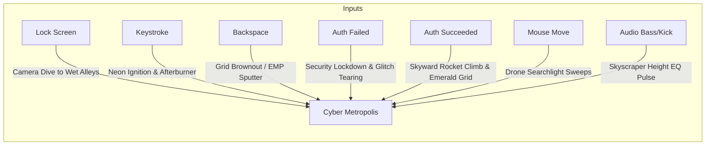

# Concept 5: Procedural Synthwave Megacity (Audio-Reactive Skyline)

## 1. Aesthetic Vision
An infinite, procedurally generated **cyberpunk / synthwave metropolis** viewed from high-rise rooftops or an elevated hover-highway. 

The city is rendered with volumetric fog, neon reflections on rain-slicked asphalt, holographic billboards, and streams of flying hovercraft. In the distance, a glowing vector wireframe grid or synthwave sunset illuminates the horizon. The entire city's architecture physically pulses, expands, and illuminates in sync with your system audio, keystrokes, and system load.

---

## 2. Event-to-Effect Mapping

### Complete Event Matrix

| Event | Visual & Simulation Reaction | Audio / Haptic Metaphor |
| :--- | :--- | :--- |
| **Lock Screen Entry (`onLock`)** | Camera drops gracefully from the clouds into an atmospheric, rain-soaked neon alley; water droplets bead on the virtual lens; neon signs flicker on. | Deep synth bass drone, muffled rain patter, neon ballast buzz. |
| **Deep Idle / Sleep (`onIdle`)** | City traffic thins to late-night solitary cruisers; thick volumetric fog rolls between towers; distant billboards display slow ambient animations. | Low-fidelity ambient synthwave chords, distant thunder. |
| **Wake / Touch (`onWake`)** | A streak of violet lightning flashes across the storm clouds; building floodlights snap to full brightness and track the camera. | Electric thunder crack, transformer hum. |
| **Password Keystroke (`onKeyStroke`)** | **Neon Ignition & Hover-Car Boost**: Each keypress fires an afterburner blast from a flying hover-vehicle across the screen and ignites a floor of skyscraper window lights. Rapid typing turns the cityscape into a buzzing hive of hyper-speed electric transit. | Mechanical synth click / tactile electronic relay snap. |
| **Backspace / Delete (`onBackspace`)** | **EMP Power Brownout**: A momentary power grid surge flickers the nearest neon signs off with an electrical buzz before they reboot. | Distorted analog tape rewind buzz. |
| **Wrong Password (`onAuthFailed`)** | **Security Protocol Lockdown**: Red defense beacons sweep across every skyscraper roof; harsh CRT chromatic glitch tearing rips through the geometry; giant holographic signs flash "ACCESS DENIED" in flashing katakana and warning glyphs. | Piercing industrial klaxon siren and digital feedback screech. |
| **Correct Password (`onAuthSucceeded`)** | **Access Granted Skyward Launch**: Sirens cut off; the entire grid pulses in radiant emerald and gold; camera rockets vertically up through the skyscraper spires, bursting through storm clouds into clear sky and unveiling your desktop. | Triumphant ascending arpeggio synth chord into crisp silence. |
| **Mouse Hover & Drag** | Cursor steers a high-intensity police drone **volumetric searchlight**. Sweeping the mouse illuminates dark building facades, alleyways, and reflects off wet glass windows. | Servo motor hum and smooth directional light sweep. |
| **Audio Beat (Kick / Sub-bass)** | The skyscraper skyline physically operates as a 3D **equalizer**: building heights and window columns pump vertically to PipeWire FFT frequency bands; sub-bass triggers rooftop strobe flashes. | Heavy acoustic kick sync, structural building vibration. |
| **Audio Treble & Mids** | Modulates holographic billboard glitch effects and the speed of flying hovercraft streams along high-altitude skyways. | Crisp synthesizer lead resonance. |
| **System Telemetry Metaphor** | **CPU Load**: Controls the density and speed of highway traffic flows.  **RAM Usage**: Fills holographic cooling towers with glowing liquid coolant. | Direct system heartbeat visualization. |

---

## 3. Technical Simulation Blueprint

### 1. Procedural Building Generation & Audio EQ
* City layout is generated on a regular grid using 2D pseudo-random hashes:
  $$\text{building\_id} = \text{hash}(\lfloor x / W \rfloor, \lfloor z / W \rfloor)$$
* Height modulation combines static seed height with dynamic PipeWire FFT frequency bands:
  $$H(x, z, t) = H_{\text{base}} + \alpha \cdot \text{FFT}(\text{band}(x, z))$$
* Window matrices are generated using procedural step functions in fragment shaders with emissive neon masks.

### 2. Volumetric Rain & Lens Droplets
* **3D Rain**: Instanced GPU line segments with motion blur falling along a wind vector.
* **Camera Lens Condensation**: 2D normal-mapped droplet distortion pass; raindrops accumulate, run down the screen via gravity, and merge using meteball blending.

### 3. Screen-Space Reflections (SSR) & Bloom
* Wet street and rooftop surfaces calculate mirror reflection rays against depth and color buffers to render accurate neon street reflections.
* Multi-pass pyramid Gaussian bloom generates intense atmospheric neon halos through volumetric rain fog.
