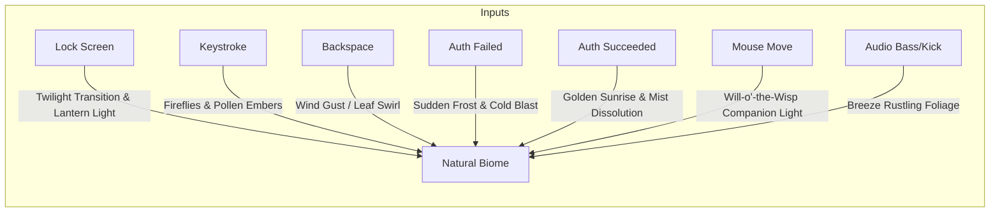

# Concept 6: Real-Time Ephemeris Biome (Procedural Weather Terrarium)

## 1. Aesthetic Vision
A stylized, living natural ecosystem—a tranquil mountain valley, mossy floating island, or procedural Japanese bonsai terrarium—rendered in a painterly, atmospheric Studio Ghibli style.

The biome is completely anchored to **real-world physical reality**:
* **Solar & Lunar Ephemeris**: The exact position, elevation, and azimuth of the sun and moon are calculated from the user's latitude, longitude, and local time. The scene smoothly cycles through dawn, brilliant midday, amber golden hour, twilight blue hour, and a star-studded night sky with the moon's accurate phase.
* **Live Atmospheric Ingestion**: Weather parameters (cloud cover, precipitation, wind speed, fog) are periodically synchronized from local open weather feeds (e.g., Open-Meteo).

---

## 2. Event-to-Effect Mapping

### Complete Event Matrix

| Event | Visual & Simulation Reaction | Audio / Haptic Metaphor |
| :--- | :--- | :--- |
| **Lock Screen Entry (`onLock`)** | Scene transitions smoothly into the current night or twilight sky; paper lanterns or mossy bioluminescence gently illuminate the scene. | Soft rustling leaves, distant evening breeze, bamboo water-clack (*shishi-odoshi*). |
| **Deep Idle / Sleep (`onIdle`)** | Time slows into deep peace: glowing fireflies drift lazily across the meadow; gentle night mist rolls between trees; stars twinkle in authentic constellations. | Calming ambient nature soundscape (distant stream, night breeze). |
| **Wake / Touch (`onWake`)** | A luminous will-o'-the-wisp awakens at the screen center, fluttering wings and illuminating the surrounding foliage. | Soft wooden chime, wind gust. |
| **Password Keystroke (`onKeyStroke`)** | **Firefly Spore Release**: Each keystroke releases a glowing golden firefly or luminescent pollen spore from the tree branches that floats upward into the breeze. Fast typing generates a dense, magical cloud of dancing golden embers. | Soft wooden kalimba note / bamboo clack scaling melodically. |
| **Backspace / Delete (`onBackspace`)** | **Autumn Leaf Gust**: A sudden gust of wind sweeps across the branches, swirling fallen leaves and dispersing fireflies in a spiral. | Clean wind whoosh through dry leaves. |
| **Wrong Password (`onAuthFailed`)** | **Sudden Mountain Frost**: Winter frost crystals rapidly spread across the camera lens and coat tree branches in white rime; a chilling gust of icy wind causes the bonsai to shudder. | Crisp ice-cracking snap and cold wind howl. |
| **Correct Password (`onAuthSucceeded`)** | **Golden Dawn Awakening**: Sunlight bursts over the mountain ridge; warm golden rays melt the frost, burn away the valley fog, and illuminate the scene in radiant morning sunlight before dissolving to desktop. | Warm harmonic dawn chime / acoustic flute swell. |
| **Mouse Hover & Drag** | Cursor transforms into a floating **will-o'-the-wisp** companion. Moving the mouse guides the wisp, casting warm dynamic point-light shadows across branches, grass blades, and rocks. | Soft fluttering wings, gentle warm hum. |
| **Audio Beat (Kick / Sub-bass)** | Sub-bass frequencies translate into physical wind gusts that sway tree branches and ripple tall grass. | Acoustic breeze resonance. |
| **Audio Treble & Mids** | High notes cause night flowers to open and release sparkling bioluminescent dust. | Sparkling wind-chime shimmer. |
| **Microphone Input** | Speaking into the mic causes soft valley fog and mist to swirl and part, exactly like warm breath on a cold autumn morning. | Soft breath condensation interaction. |

---

## 3. Technical Simulation Blueprint

### 1. Astronomical Ephemeris Calculation
Calculates solar altitude $\alpha$ and azimuth $A$ from local Julian date $JD$, latitude $\phi$, and longitude $\lambda$:
$$\sin \alpha = \sin \phi \sin \delta + \cos \phi \cos \delta \cos H$$
$$\cos A = \frac{\sin \delta - \sin \alpha \sin \phi}{\cos \alpha \cos \phi}$$
* $\delta$: Solar declination angle.
* $H$: Local solar hour angle.
* Coordinates drive dynamic directional shadow cascades and an analytical **Hosek-Wilkie / Preetham atmospheric scattering** sky dome.

### 2. Procedural Tree & Foliage Wind Vertex Shader
Foliage geometry utilizes vertex-displacement shaders simulating hierarchical wind turbulence:
$$\mathbf{p}_{\text{displaced}} = \mathbf{p} + \left(\mathbf{v}_{\text{trunk\_sway}} + \mathbf{v}_{\text{branch\_bend}} + \mathbf{v}_{\text{leaf\_flutter}}\right)$$
* Trunk sway uses low-frequency sine waves aligned with weather wind direction.
* Leaf flutter uses high-frequency Perlin noise phase-shifted across individual leaf clusters.

### 3. Lightweight Weather Ingestion Engine
* Background C++/QML timer queries cached local meteorological feeds once every 30 minutes.
* Extracts: Rain rate (mm/h), snow accumulation, cloud coverage (0–100%), and wind speed. Zero CPU impact during active simulation.
