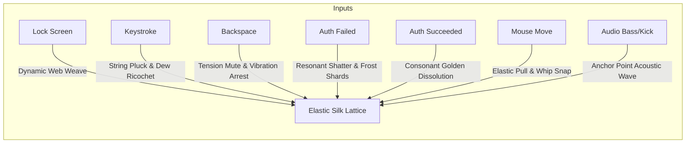

# Concept 7: Kinetic Spiderweb & Resonance Harp (Tactile Elastic Lattice)

## 1. Aesthetic Vision
An intricate, mathematically organic **spiderweb and geometric silk membrane** suspended across the screen against a dark, moody architectural void or moonlit canopy. 

The web is composed of hundreds of interconnected elastic silk filaments bearing hundreds of crystalline, spherical **morning dew drops**. Each dew drop functions as an optical prism, refracting background colors, desktop lighting, and casting sharp caustic glints. 

The system operates as a **physical acoustic instrument**: pulling, striking, or vibrating web strands generates true mass-spring physical wave propagation, behaving like a mystical, glowing laser harp.

---

## 2. Event-to-Effect Mapping

### Complete Event Matrix

| Event | Visual & Simulation Reaction | Audio / Haptic Metaphor |
| :--- | :--- | :--- |
| **Lock Screen Entry (`onLock`)** | Fine geometric silk filaments dynamically weave themselves across the screen from anchor points; dew drops condense rapidly on thread intersections. | Delicate high-tension silk stretch, crystal dew condensation chiming. |
| **Deep Idle / Sleep (`onIdle`)** | The web sways gently in ambient drafts; dew drops glimmer softly as moonlight shifts; periodic relaxation waves travel across radial threads. | Ethereal aeolian harp wind hum. |
| **Wake / Touch (`onWake`)** | A single dew drop rolls down the primary structural silk line, striking cross-nodes with sparkling harmonic chimes. | Pure crystal glass ping. |
| **Password Keystroke (`onKeyStroke`)** | **Harp String Pluck & Droplet Fling**: Each keystroke violently plucks a specific silk strand at a distinct pitch and geometric angle. The vibrating strand oscillates visibly with high-frequency wave motion, flinging gleaming dew drops that collide and ricochet off neighboring strands. Rapid typing triggers a breathtaking, polyphonic kinetic symphony of sound and light. | Crisp acoustic harp string pluck, pitch mapped harmonically to keystrokes. |
| **Backspace / Delete (`onBackspace`)** | **Harmonic Dampener (Mute)**: Instantly dampens vibrating strands with an elastic clamp, arresting oscillations with a tactile acoustic thud. | Muted string palm-slap. |
| **Wrong Password (`onAuthFailed`)** | **Resonant Shatter**: A discordant, destructive resonant shockwave shatters the web's structural equilibrium: hundreds of frozen dew crystals shatter into glittering shards; silk strands snap under extreme tension and whip backward before auto-repairing. | Harsh dissonant glass shatter and snapped-string whip crack. |
| **Correct Password (`onAuthSucceeded`)** | **Consonant Golden Dissolution**: The entire web vibrates at a pure, triumphant consonant chord; strands transform into glowing golden threads of light that untether from anchors and sweep gracefully away, revealing the desktop. | Lush resonant cello chord ascending into golden silence. |
| **Mouse Hover & Drag** | Users can click and **drag any silk strand**, stretching it with genuine elastic spring tension. Releasing snaps the strand back with realistic rebound, launching dewdrops on parabolic physics trajectories. | Tactile rubberized string pull and whip snap. |
| **Audio Beat (Kick / Sub-bass)** | Sub-bass pulses travel through screen boundary anchors, setting up visible standing wave nodes (vibration antinodes) along the main radial threads. | Deep acoustic body resonance. |
| **Audio Treble & Mids** | High synthesizer notes and strings make individual spiral threads ring and emit micro-prismatic flashes. | Shimmering glass harmonica vibration. |
| **Microphone Input** | Speaking into the mic vibrates the entire web lattice as if it were the ultra-sensitive physical diaphragm of an acoustic microphone. | Voice-to-membrane acoustic vibration. |

---

## 3. Technical Simulation Blueprint

### 1. Mass-Spring-Damper Network (Position-Based Dynamics / Verlet)
The web consists of $N$ nodes connected by $M$ elastic springs. The state is integrated using Verlet integration:
$$\mathbf{x}_i^{t + \Delta t} = 2\mathbf{x}_i^t - \mathbf{x}_i^{t - \Delta t} + \mathbf{a}_i \Delta t^2$$

Internal spring tension forces between connected nodes $(i, j)$:
$$\mathbf{F}_{ij} = -k_s (\|\mathbf{x}_i - \mathbf{x}_j\| - L_0) \frac{\mathbf{x}_i - \mathbf{x}_j}{\|\mathbf{x}_i - \mathbf{x}_j\|} - k_d (\mathbf{v}_i - \mathbf{v}_j)$$
* $k_s$: Structural spring stiffness.
* $k_d$: Damping coefficient (controls how long plucked strings ring).
* $L_0$: Rest length of the silk segment.

### 2. Physical String Harmonic Wave Equation
Plucked silk strands simulate physical transverse wave propagation:
$$y(x, t) = \sum_{n=1}^\infty A_n \sin\left(\frac{n\pi x}{L}\right) \cos(\omega_n t) e^{-\gamma_n t}$$
* Frequencies $\omega_n = \frac{n\pi}{L} \sqrt{\frac{T}{\mu}}$ scale with strand tension $T$ and linear density $\mu$.
* Produces authentic visual harmonics (fundamental, second harmonic nodes) along the thread.

### 3. Dew Drop Optical Prism Shader
Each dewdrop is rendered as a sphere with dielectric refraction and Fresnel specular reflection:
* **Fresnel Schlick Approximation**:
  $$R(\theta) = R_0 + (1 - R_0)(1 - \cos \theta)^5$$
* **Chromatic Dispersion**: Refracts red, green, and blue wavelengths with slightly different indices of refraction ($\eta_R = 1.331, \eta_G = 1.333, \eta_B = 1.338$), generating prismatic rainbows and sparkling caustic glints on screen.
