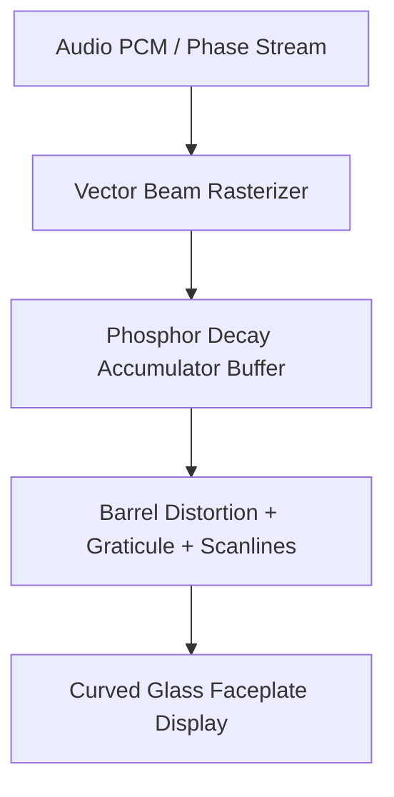

# Concept 8: The Analog Telemetry Console (Vintage Galvanometers, Vacuum Tubes & Phosphor Oscilloscope)

## 1. Aesthetic Vision
A lovingly rendered, photorealistic retro-scientific **analog telemetry and acoustics console** inspired by 1960s–1970s aerospace mission control equipment, high-end laboratory gear (Tektronix, HP, Brüel & Kjær), and vintage vacuum-tube audio monitoring desks.

The console is set in a chassis of dark anodized rack-mount brushed metal, knurled thumb-screws, and matte-black bezels:
* **Symmetric Hex-Meter Ballistic Galvanometers (VU Meters)**: Six identically sized studio form-factor moving-coil meters (Left Wing: Sub-Bass, Bass, Master RMS; Right Wing: Mids, Treble, Vocal Energy) illuminated by warm incandescent tungsten edge-lighting behind curved convex glass. Needles have authentic mechanical mass, inertia, spring recoil, and overshoot conforming to ANSI C16.5 ballistic standards, rotated via zero-overhead GPU scenegraph transforms.
* **External Chassis Jewel Pilot Lamps with Peak-Hold Pulse Stretchers**: Six faceted, cut-glass indicator lenses mounted on dark anodized chassis bars outside the meter enclosures (BAR Ruby Red, BEAT Amber Gold, READY Cobalt Blue, PRES Citrine Yellow, TRANS Xenon White, VOCAL Emerald Green). Equipped with asymmetric peak-hold pulse stretchers (<2 ms attack, 45 ms hold plateau, 160 ms decay) to ensure sub-frame 16 ms rhythmic events are vibrantly visible.
* **Center Core Telemetry Instrumentation**:
  - **Nixie Tube BPM Readout**: Genuine cold-cathode neon glow discharge tubes displaying real-time tempo (BPM) with internal wire-mesh anodes, stacked numeric cathodes, and subtle violet-blue mercury Penning aura.
  - **Circular Green Phosphor CRT Oscilloscope**: A 5-inch circular cathode-ray tube with P1/P31 green phosphor, etched graticule glass, raster beam retrace trails, and dual modes (Waveform Sweep and Stereophonic Lissajous Ellipse).
  - **Engraved Serial Plaque**: Mil-spec vintage telemetry identification plate.

Every signal from `org.regel.Audio`—continuous frequencies, discrete beats, vocal detection, and system states—has a direct, tactile physical manifestation.

---

## 2. Event-to-Effect Mapping

```mermaid
graph LR
    subgraph D-Bus Audio & Inputs
        SUB["Sub-Bass 20-60Hz"] -->|Torque Coil| M1["Sub-Bass Galvanometer"]
        BASS["Bass 60-250Hz"] -->|Torque Coil| M2["Bass Galvanometer"]
        RMS["Master RMS Full-Band"] -->|Torque Coil| M3["Master RMS Galvanometer"]
        MID["Mids 250Hz-4kHz"] -->|Torque Coil| M4["Mids Galvanometer"]
        TREB["Treble 4k-20kHz"] -->|Torque Coil| M5["Treble Galvanometer"]
        VOC_E["Vocal Energy Formant"] -->|Torque Coil| M6["Vocal Energy Galvanometer"]
        
        DBEAT["Downbeat Measure Pulse"] -->|Pulse Stretcher| L1["BAR Ruby Jewel Lamp"]
        BEAT["Beat Quarter-Note"] -->|Pulse Stretcher| L2["BEAT Amber Jewel Lamp"]
        STREAM["Stream Status"] -->|Steady Latch| L3["READY Cobalt Blue Lamp"]
        PRES["Mids Presence"] -->|Pulse Stretcher| L4["PRES Citrine Yellow Lamp"]
        TRANS["Transient Attack Flash"] -->|Fast Strobe| L5["TRANS Xenon White Lamp"]
        VOC_B["Is Vocal Active"] -->|Relay Latch| L6["VOCAL Emerald Lamp"]

        BPM["Tempo BPM"] -->|Cathode Switch| NIX["Nixie Tube Display"]
        PHASE["Beat Phase 0..1"] -->|Timebase Sync| CRT["Phosphor CRT Scope"]
        KEY["Lock Keystroke"] -->|Vibration Shock| NEEDLE["Needle Micro-Jitter"]
        FAIL["Auth Failed"] -->|Overvoltage Fault| TRIP["Redline Peg & Spark"]
    end
```

### Complete Event Matrix

| Event / Signal | Physical Telemetry Reaction | Audio / Mechanical Metaphor |
| :--- | :--- | :--- |
| **Lock Screen Entry (`onLock`)** | **High-Voltage Power Up**: Heavy mechanical knife switch / relay clack. Vacuum tubes flare warm orange; CRT phosphor dot blossoms and expands into horizontal sweep line; jewel pilot lamps slowly warm to idle filament luminescence. | Heavy solenoid clonk, 50/60 Hz transformer hum fading into quiet tape hiss. |
| **Deep Idle / Sleep (`onIdle`)** | Meters drop to zero-point resting pins. Nixie tubes dim to sleep glow. CRT transitions from waveform trace to a slow, drifting Lissajous standby circle. | Ultra-quiet cooling fan whisper and gentle tube filament warmth. |
| **Wake / Touch (`onWake`)** | Relays snap shut. Galvanometer needles flick upward to calibrate against their zero-stop springs. CRT brightens. | Crisp toggle switch click, instantaneous phosphor brightness surge. |
| **Password Keystroke (`onKeyStroke`)** | **Mechanical Vibration Jitter**: Keystrokes send physical mechanical shock through the chassis; galvanometer needles twitch with sharp inertial micro-deflections. CRT beam exhibits momentary high-voltage deflection twitch. | Heavy IBM Model M buckling spring clatter; metallic frame resonance. |
| **Backspace / Delete (`onBackspace`)** | Needles dip momentarily backward below baseline before stabilizing. | Solenoid recoil clack. |
| **Wrong Password (`onAuthFailed`)** | **Overvoltage Relay Overload**: Meter coils peg violently against the redline stop pins with an audible clink. The red "FAULT / OVERLOAD" jewel lamp flashes violently. An internal high-voltage neon glow tube flickers and arcs before circuit breakers trip and reset. | Violent mechanical needle pegging clink, electrical relay chatter, loud fuse snap. |
| **Correct Password (`onAuthSucceeded`)** | **Instrument Calibration Sweep**: All meters smoothly execute a 0% $\to$ 100% $\to$ 0% full-scale calibration arc. The emerald "READY / ONLINE" jewel lamp latches bright green. The CRT traces a harmonious spiral iris that clears to reveal the desktop. | Harmonious multi-tone calibration sweep, soft vacuum relay click. |
| **Mouse Hover & Tap on Glass** | Hovering casts realistic dynamic specular glints across the curved glass meter covers. Clicking/tapping the glass causes the needle underneath to physically quiver and settle via 2nd-order spring damping. | Tactile glass fingertip tap. |
| **Sub-Bass (`sub_bass`) & Downbeat** | Drives the **Left Sub-Bass Galvanometer** (20–60 Hz). Accompanied by the external chassis **BAR (Ruby Red)** pilot lamp pulsing on measure downbeats. | Sub-audible acoustic weight. |
| **Bass (`bass`) & Beat** | Drives the **Left Bass Galvanometer** (60–250 Hz). Accompanied by the external chassis **BEAT (Amber Gold)** pilot lamp pulsing on quarter notes. | Rhythmic punch and heartbeat. |
| **Master RMS (`rms`) & Ready** | Drives the **Left Master RMS Galvanometer** (full audio bandwidth). Accompanied by the external chassis **READY (Cobalt Blue)** pilot lamp indicating stream lock. | Master acoustic power level. |
| **Mids (`mids`) & Presence** | Drives the **Right Mids Galvanometer** (250 Hz–4 kHz). Accompanied by the external chassis **PRES (Citrine Yellow)** presence lamp. | Vocal and instrumental core. |
| **Treble (`treble`) & Transient** | Drives the **Right Treble Galvanometer** (4–20 kHz). Accompanied by the external chassis **TRANS (Xenon White)** pilot lamp strobing on sudden acoustic onset attacks. | High-frequency shimmer & percussive attack. |
| **Vocal Energy (`vocal_energy`, `is_vocal`)** | Drives the **Right Vocal Energy Galvanometer** (melodic formant tracking). Accompanied by the external chassis **VOCAL (Emerald Green)** pilot lamp latching when singing is detected. | Formant power & lyrical activity. |
| **Tempo (`bpm`)** | **Dual Nixie Tubes**: Digitally decodes BPM (e.g. `1`, `2`, `4`) on genuine neon glowing wire cathodes. Digits cross-fade smoothly with ionization glow persistence. | Retro-futuristic digital readout. |
| **Beat Phase (`beat_phase`) & Waveform** | **Phosphor CRT Sweep**: The horizontal timebase sweep or circular Lissajous trajectory of the oscilloscope locks to `beat_phase` ($0.0 \to 1.0$), ensuring the waveform visualization stays rock-solid stationary and perfectly synchronized to the tempo. | Phase-locked vector beam display. |

---

## 3. Mathematical & Physical Simulation Blueprint

### 1. Second-Order Damped Galvanometer Ballistics (ANSI C16.5 Standard)
An authentic VU meter is not a simple linear lerp; it is a physical moving-coil galvanometer suspended by torsion hairsprings in a permanent magnetic field.

The angular displacement $\theta(t)$ obeys the second-order differential equation:
$$J \frac{d^2\theta}{dt^2} + c \frac{d\theta}{dt} + k \theta = \tau_m(t)$$

Where:
* $J$: Moment of inertia of the aluminum pointer needle and coil assembly.
* $c$: Electromagnetic and mechanical damping coefficient.
* $k$: Torsion spring restoring constant.
* $\tau_m(t) \propto V_{\text{rectified}}(t)$: Electromagnetic torque produced by audio current.

#### Dimensionless Standard Form:
$$\frac{d^2\theta}{dt^2} + 2\zeta \omega_n \frac{d\theta}{dt} + \omega_n^2 \theta = \omega_n^2 \theta_{\text{target}}(t)$$

According to the **ANSI C16.5 VU meter specification**:
* **Rise Time**: A sudden step input from 0 to $0\text{ VU}$ ($100\%$ scale) must reach $99\%$ in exactly $300\text{ ms} \pm 10\%$.
* **Overshoot**: The needle must overshoot between $1.0\%$ and $1.5\%$ before settling.
* **Damping Ratio**: $\zeta \approx 0.82$ (slightly underdamped).
* **Natural Frequency**: $\omega_n \approx 14.5\text{ rad/s}$.

The engine numerically integrates this using a 4th-order Runge-Kutta (RK4) or Semi-Implicit Euler step at 60 Hz, ensuring zero jitter and authentic mechanical mass.

---

### 2. Jewel Pilot Lamp Filament & Lens Optics
Incandescent lamps have thermal thermal inertia; they do not switch on or off instantaneously.

#### Filament Thermal Rise, Fall & Peak-Hold Pulse Stretcher:
$$\frac{dT}{dt} = \frac{P_{\text{in}}(t) - \sigma A (T^4 - T_{\text{ambient}}^4)}{C_{\text{thermal}}}$$
* Approximate linear-log heuristic for shader uniform:
  $$L(t + \Delta t) = L(t) + (L_{\text{target}} - L(t)) \cdot \left(1 - e^{-\Delta t / \tau_{\text{thermal}}}\right)$$
  where $\tau_{\text{rise}} = 45\text{ ms}$ (heating) and $\tau_{\text{decay}} = 120\text{ ms}$ (cooling filament afterglow).

#### Asymmetric Peak-Hold Pulse Stretcher (Micro-Choreography Filter):
Audio events such as rhythmic downbeats, beats, and transient hits often occur over tiny time slices ($<16\text{ ms}$, within a single video refresh frame). If rendered strictly instantaneously, human persistence of vision and frame-timing quantization make these pulses appear faint or missed entirely.
To ensure crisp, incandescent visibility without sluggishness:
* **Attack Stage**: Instantaneous rise ($<2\text{ ms}$) upon receiving the boolean trigger edge.
* **Hold Stage**: Saturated peak luminance held for $45\text{ ms}$ (3 display frames at 60 Hz).
* **Decay Stage**: Exponential filament cool-off envelope with $\tau = 160\text{ ms}$.

#### Faceted Glass Shader:
The jewel cap is rendered using a normal-mapped hexagonal or diamond faceting texture. Incoming light undergoes:
1. Internal total reflection inside glass facets ($n_{\text{glass}} = 1.52$).
2. Chromatic absorption according to lamp tint (Ruby 650nm, Amber 590nm, Emerald 520nm).
3. Soft bloom halo representing atmospheric scattering and front-panel bezel glow.

---

### 3. Nixie Tube Cold-Cathode Ionization Model
Nixie display digits do not behave like LEDs. Each tube contains:
* Stacked metallic wire numerals (0 to 9) in a low-pressure Neon/Argon Penning gas mixture ($99.85\%\text{ Ne} + 0.15\%\text{ Ar}$).
* When activated, the active digit cathode is engulfed in a velvety orange **negative glow** ($\sim 585\text{--}650\text{ nm}$).
* Inactive digits in front of the lit numeral cast subtle fine-wire silhouettes and reflections.
* Rapid digit transitions exhibit slight ionization cross-fade ($\sim 15\text{ ms}$) rather than abrupt digital flips.
* A faint purple/blue aura hugs the cathode pins due to trace mercury vapor added for longevity.

---

### 4. CRT Phosphor Oscilloscope Shader Pipeline

The circular CRT oscilloscope is simulated using a dedicated multi-pass Qt 6 RHI fragment shader:

1. **Curvature & Glass Reflection Pass**:
   The screen faceplate is a convex spherical surface:
   $$\mathbf{u}' = \mathbf{u} + (\mathbf{u} - 0.5) \cdot \|\mathbf{u} - 0.5\|^2 \cdot k_{\text{barrel}}$$
2. **Graticule Etching Pass**:
   A lit centimeter grid etched into the inner glass face, edge-lit by amber or green incandescent bulbs.
3. **P1 Phosphor Persistence Decay & Qt 6 RHI Ping-Pong Buffer Architecture**:
   P1 silicate phosphor exhibits a double-exponential decay curve:
   $$I_{\text{phosphor}}(t) = I_0 \left(0.8 e^{-t / \tau_{\text{fast}}} + 0.2 e^{-t / \tau_{\text{slow}}}\right)$$
   Where $\tau_{\text{fast}} = 1.5\text{ ms}$ (primary trace) and $\tau_{\text{slow}} = 25\text{ ms}$ (ghost afterglow).

   **GPU Feedback Architecture (Qt 6 RHI / Vulkan)**:
   In modern graphics APIs (Vulkan, Metal, Direct3D 12), simultaneously reading from and writing to the same framebuffer attachment causes undefined behavior and barrier race conditions. 
   To execute temporal accumulation cleanly in Qt 6:
   * Two alternating offscreen framebuffers (`PhosphorAccumBufferA` and `PhosphorAccumBufferB`) are defined using paired `ShaderEffectSource` elements.
   * **Ping-Pong Feedback Loop**:
     - Frame $N$: `PhosphorAccumBufferB` binds `PhosphorAccumBufferA` as an input sampler texture, applies the exponential decay matrix ($e^{-\Delta t / \tau}$), and renders the new audio beam trace additively on top.
     - Frame $N+1$: `PhosphorAccumBufferA` binds `PhosphorAccumBufferB` as its input sampler.
   * The final presentation pass samples the active accumulator target, applying spherical barrel distortion, scanline grating, glass reflection, and graticule illumination.
4. **Phase-Locked Lissajous XY Trace**:
   When `beat_phase` is active, the oscilloscope maps Left Channel to X and Right Channel to Y, forming rotating phase ellipses that deform into resonant figures with vocal harmonics.

---

## 4. Technical Implementation & Plasma Integration

* **QML Architecture (`engine/AnalogTelemetryConsole.qml`)**:
  - **Symmetric 3-Column Studio Console**:
    - **Left Wing (3 Uniform Meters)**: `SUB-BASS` (20–60 Hz), `BASS` (60–250 Hz), `MASTER RMS` (full audio bandwidth).
    - **Center Core Instrumentation**: 3-digit IN-14 Nixie tube BPM display, 5-inch circular P1 phosphor CRT oscilloscope, and vintage mil-spec telemetry serial plaque.
    - **Right Wing (3 Uniform Meters)**: `MIDS` (250 Hz–4 kHz), `TREBLE` (4–20 kHz), `VOCAL ENERGY` (melodic formant power).
  - **Identical Ballistic Galvanometers**: All 6 meters share identical 2.5:1 studio dimensions ($442\text{px} \times 174\text{px}$) with ANSI C16.5 2nd-order ODE physics integration ($\zeta = 0.72$, rise time $300\text{ ms}$, overshoot $\sim 1.2\%$).
  - **Hardware-Accelerated Scenegraph Optimization**:
    - Static dial scale faces are rendered once and cached in GPU Framebuffer Objects (`renderTarget: Canvas.FramebufferObject`).
    - Galvanometer needles are decoupled from Canvas and rotated via zero-overhead Qt Quick hardware transforms (`rotation: needleAngle`) with soft needle drop shadows.
    - Zero per-frame JavaScript canvas repainting across all 6 meters.
  - **External Chassis Pilot Lamps**:
    - 6 faceted jewel lamps placed on dark anodized mounting strips outside the sealed meter glass.
    - Driven by asymmetric peak-hold pulse stretchers ($<2\text{ ms}$ attack, $45\text{ ms}$ saturated hold, $160\text{ ms}$ exponential decay).
  - **P1 Phosphor CRT Oscilloscope**:
    - Phase-locked to continuous `beat_phase` ($0.0 \to 1.0$) with dual display modes: Timebase Waveform Sweep and Stereophonic Lissajous Ellipse.
* **Performance Budget**:
  - Entire 6-meter console runs at $< 2.5\text{ ms}$ per frame on integrated Intel Iris Xe / AMD Radeon 680M graphics.
  - DPMS screen-off and occlusion handling automatically halts animation loops when obscured.
