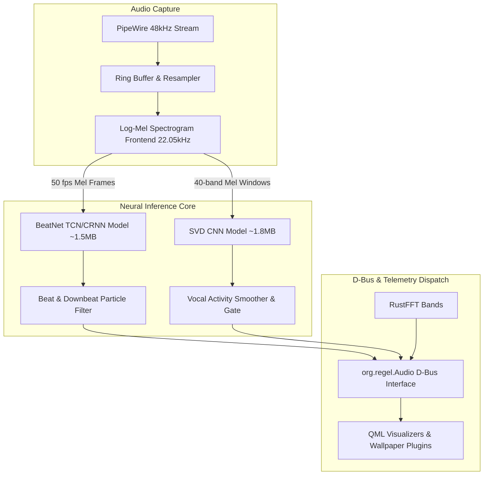
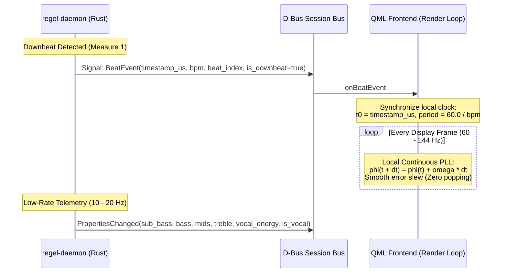

# Neural Audio Subsystem: BeatNet, Vocal Detection & D-Bus Telemetry

## 1. Vision & Architectural Rationale

### The Limitations of Pure Spectral FFT
The baseline `regel-daemon` uses a SIMD-accelerated Fast Fourier Transform (`rustfft`) to decompose PipeWire audio streams into five coarse frequency bands (`sub_bass`, `bass`, `mids`, `treble`, `rms`) and a simple derivative energy threshold for `transient`. 

While reactive, pure FFT audio visualizers suffer from inherent perceptual flaws:
1. **No Predictive Rhythm**: FFT is strictly reactive. When a kick drum hits, the visualizer spikes *after* the fact. It cannot anticipate the beat, causing physics simulations (e.g. fluid vortexes, koi strokes) to appear jittery rather than musically coordinated.
2. **Downbeat Blindness**: FFT cannot differentiate beat 1 of a measure (the downbeat) from beat 2, 3, or 4. Complex musical phrases, chord changes, and macro-drops cannot be distinguished from ordinary metronome clicks.
3. **Harmonic Confusion (Voice vs Instruments)**: High energy in the 300–3000 Hz band can be an electric guitar, a synthesizer lead, a saxophone, or a human voice. Traditional DSP cannot isolate whether someone is singing.

### The Neural Upgrade
By integrating lightweight, edge-optimized deep learning models running on CPU via ONNX Runtime (`ort`):
* **BeatNet (Recurrent Neural Network / TCN)** extracts **meter-aware tempo (`bpm`)**, **discrete beats (`beat`)**, **measure starts (`downbeat`)**, and a **continuous phase ramp (`beat_phase`)**.
* **Singing Voice Detection (SVD)** isolates vocal presence (`is_vocal`) and vocal melodic intensity (`vocal_energy`) without requiring computationally prohibitive full multi-track stem separation (such as Demucs or Spleeter).

The result transforms `regel_screensaver` from a passive frequency meter into an intelligent conductor that understands musical structure.

---

## 2. Machine Learning Architecture & Model Selection



### 1. Beat & Downbeat Tracking: BeatNet ONNX
* **Model Class**: Lightweight Temporal Convolutional Network (TCN) + Recurrent Particle Filter state space decoder (Heydari et al.).
* **Input**: 2-channel Log-Mel spectrogram (22,050 Hz sampling rate, 1024-point FFT with 512-sample hop size $\approx 23.2\text{ ms}$ per frame).
* **Model Size**: $\sim 1.5\text{ MB}$ quantized ONNX weight file.
* **Outputs**:
  - `beat` (boolean pulse): Fires on every quarter-note beat.
  - `downbeat` (boolean pulse): Fires on the primary measure accent (beat 1 of 4/4 or 3/4).
  - `bpm` (float64): Real-time tempo tracking with octave error prevention (range $40.0\text{--}240.0$).
  - `beat_phase` (float64 $0.0 \to 1.0$): Continuous cyclic sawtooth ramp representing normalized elapsed time within the current beat interval.
* **Latency**: Algorithmic latency $\le 25\text{ ms}$; inference execution time $< 1.2\text{ ms}$ per frame on a single CPU thread.
* **Odd Time Signatures & Polyrhythms (5/4, 7/8, Free-Form)**:
  - The particle filter evaluates concurrent meter hypotheses ($M \in \{3/4, 4/4, 6/8, 5/4\}$).
  - When musical complexity causes meter confidence to fall below a strict threshold ($\text{Conf}_{\text{meter}} < 0.60$), the daemon **suppresses the downbeat** while continuing to output reliable quarter-note `beat` pulses and `bpm`. This prevents erratic, strobe-like downbeat misfires during polyrhythmic jazz or math-rock passages.

### 2. Vocal Activity & Melodic Energy: SVD (Singing Voice Detection)
* **Model Class**: Lightweight 2D MobileNet / SqueezeNet-derived Convolutional Neural Network trained on vocal presence classification.
* **Why Stem Separation (Demucs / StemGenRT) Was Rejected**:
  - Full 4-stem real-time audio separation requires multi-core CPU loads exceeding $35\text{--}60\%$, $\sim 400\text{ MB}$ RAM footprint, and minimum buffer latencies of $150\text{--}300\text{ ms}$.
  - Screensavers and wallpaper engines must run unobtrusively in the background without stealing cycles from user workflows, compilers, or 3D games.
* **Discriminating Melodic Singing from Spoken Word / Podcasts**:
  - Raw Voice Activity Detection (VAD) triggers falsely on podcast conversations, gaming voice chat, and narration.
  - SVD combines the CNN spectral classifier with a **Harmonic Pitch Saliency Metric**:
    $$\text{Saliency} = \frac{\sum_{k=1}^K |X(k \cdot f_0)|^2}{\|X\|^2}$$
  - Unpitched spoken dialogue exhibits chaotic fundamental frequency jumps and low harmonic-to-noise ratio (HNR), remaining below the activation threshold ($\text{Conf}_{\text{singing}} < 0.65$).
  - Sustained melodic vocal contours (singing) trigger clean, stable `is_vocal = true` latching with 150ms hysteresis.
* **Outputs**:
  - `is_vocal` (boolean): Flag indicating genuine melodic singing presence.
  - `vocal_energy` (float64 $0.0 \to 1.0$): Normalized energy concentrated within the vocal formant spectrum ($800\text{ Hz}\text{--}3500\text{ Hz}$).
* **Model Size**: $\sim 1.8\text{ MB}$ ONNX model. CPU utilization $< 0.8\%$ single-core.

### 3. Energy Gating & Silence Auto-Bypass (Zero-CPU Idle)
To prevent neural networks from hallucinating phantom beats or vocal energy during track transitions, quiet dialogue, or background line hum:
* **Pre-Inference Noise Gate**: The DSP frontend monitors short-term RMS energy:
  $$E_{\text{rms}} = \sqrt{\frac{1}{N} \sum_{n=0}^{N-1} x[n]^2}$$
* **Low-Power Fallback**:
  - If $E_{\text{rms}} < -48\text{ dBFS}$ for $> 300\text{ ms}$, the daemon **parks the neural inference thread** via condition variables (`std::sync::Condvar`).
  - Emits neutral telemetry: `beat = false`, `downbeat = false`, `is_vocal = false`, `vocal_energy = 0.0`.
  - CPU consumption drops from $2.5\%$ to $< 0.1\%$ during silence.
  - When audio returns above threshold, inference resumes within a single 23ms window.

---

## 3. High-Performance D-Bus Schema & Bus Load Optimization

A critical architectural pitfall is streaming high-rate continuous properties (e.g. 60 Hz `beat_phase`) over the system D-Bus daemon. Transmitting 60–120 D-Bus messages per second causes unnecessary context switching and CPU wakeups in `dbus-daemon`.

To guarantee peak performance, `regel_screensaver` employs a **Hybrid Event-Extrapolation Protocol**:



### Digital Phase-Locked Loop (PLL) for Rubato & Jitter Smoothing
A naive modulo calculation (`((frameTime - t0) / period) % 1.0`) introduces **visual phase popping**: if a song undergoes tempo drift (rubato) or an IPC message arrives slightly jittered, the phase can abruptly jump from $0.92$ to $0.05$ mid-frame, causing jarring visual tears in fluid velocity or particle orbits.

To achieve liquid continuity, the QML client implements a **Second-Order Digital Phase-Locked Loop (DPLL)**:
1. **Local Phase Oscillator**:
   $$\phi(t + \Delta t) = \left(\phi(t) + \omega_{\text{local}} \cdot \Delta t\right) \pmod{1.0}$$
2. **Phase Error Detection**:
   When a `BeatEvent` arrives at timestamp $t_{\text{event}}$, the phase detector calculates the minimum wrapped circular phase error:
   $$\epsilon_\phi = \frac{1}{2\pi} \text{atan2}\left(\sin(2\pi (0.0 - \phi(t))), \cos(2\pi (0.0 - \phi(t)))\right)$$
3. **Loop Filter Frequency Slew**:
   The frequency of the local oscillator $\omega_{\text{local}}$ is steered smoothly using a Proportional-Integral (PI) governor:
   $$\omega_{\text{local}}(t) = \frac{\text{BPM}}{60.0} + K_p \epsilon_\phi + K_i \int \epsilon_\phi \, dt$$
   With $K_p = 0.18$ and $K_i = 0.025$, the phase error is smoothly absorbed over 3–5 frames without any perceptible discontinuity, even during dramatic tempo accelerandos or ritardandos.

### Complete D-Bus Interface: `org.regel.Audio`

```xml
<!DOCTYPE node PUBLIC "-//freedesktop//DTD D-BUS Object Introspection 1.0//EN"
"http://www.freedesktop.org/standards/dbus/1.0/introspect.dtd">
<node>
  <interface name="org.regel.Audio">
    <!-- Existing Spectral & Gain Properties -->
    <property name="sub_bass" type="d" access="read"/>
    <property name="bass" type="d" access="read"/>
    <property name="mids" type="d" access="read"/>
    <property name="treble" type="d" access="read"/>
    <property name="rms" type="d" access="read"/>
    <property name="transient" type="b" access="read"/>
    <property name="source" type="s" access="read"/>
    <property name="gain" type="d" access="read"/>
    <property name="auto_gain" type="b" access="read"/>

    <!-- Neural Beat & Tempo Properties -->
    <property name="bpm" type="d" access="read"/>
    <property name="beat" type="b" access="read"/>
    <property name="downbeat" type="b" access="read"/>
    
    <!-- Neural Vocal Properties -->
    <property name="is_vocal" type="b" access="read"/>
    <property name="vocal_energy" type="d" access="read"/>

    <!-- High-Precision Beat Synchronization Signal -->
    <signal name="Beat">
      <arg name="timestamp_us" type="t"/>
      <arg name="bpm" type="d"/>
      <arg name="beat_index" type="u"/>
      <arg name="is_downbeat" type="b"/>
    </signal>

    <!-- Control Methods -->
    <method name="SetSource">
      <arg name="source" direction="in" type="s"/>
    </method>
    <method name="SetGain">
      <arg name="gain" direction="in" type="d"/>
    </method>
    <method name="SetAutoGain">
      <arg name="auto_gain" direction="in" type="b"/>
    </method>
  </interface>
</node>
```

---

## 4. Concept Choreography Enhancements (Concepts 1 through 7)

With discrete downbeats, continuous beat phase, and isolated vocal presence, the existing visualizer archetypes evolve from reactive frequency wobblers into choreographed digital performance pieces.

### Concept 1: Liquid Neon Abyss (Fluid Dynamics)
* **Downbeat (`downbeat`)**: Fires an explosive high-velocity dye burst from the central singularity with an automatic harmonic color palette step (e.g. from cyan/magenta to amber/ultraviolet).
* **Beat Phase (`beat_phase`)**: Modulates fluid advection vorticity in a rhythmic breathing cycle ($\omega(t) = \omega_0 \cdot \sin(\pi \cdot \text{beat\_phase})$). Swirls tighten and loosen in predictive sync with the tempo.
* **Vocal Energy (`vocal_energy`, `is_vocal`)**: When singing begins, delicate bioluminescent filament wisps thread across the fluid surface. High vocal energy increases surface refraction and optical caustics.

### Concept 2: The Living Petri Dish (Lenia Continuous Automata)
* **Tempo (`bpm`)**: Locks the metabolic clock of the simulated microbes. Colony division rates scale organically with music tempo.
* **Downbeat (`downbeat`)**: Triggers an instantaneous mitosis wave: mature Lenia organisms divide into daughter rings across the cellular grid.
* **Beat Phase (`beat_phase`)**: Drives peristaltic pumping motion of cellular membranes: organisms contract and expand with rhythmic biological respiration.
* **Vocal Energy (`vocal_energy`)**: Activates intracellular fluorescent proteins (GFP green / mCherry crimson glow) inside organism nuclei, causing the colony to radiate luminescence in harmony with the singer's voice.

### Concept 3: The Tranquil Sanctuary (Caustic Koi Pond)
* **Beat Phase (`beat_phase`)**: Fish locomotion transitions from randomized roaming to phase-locked swimming strokes. Koi tail flukes beat back and forth in perfect synchrony with the musical rhythm.
* **Downbeat (`downbeat`)**: Triggers a new lotus flower bud to surface and bloom, accompanied by expanding concentric water ripples.
* **Vocal Energy (`is_vocal`)**: The presence of human singing calms the pond: koi congregate toward the center of the screen in a swirling, peaceful mandala.
* **Transient (`transient`)**: Sudden drum snares or claps make the fish dart outward in momentary startle response.

### Concept 4: Cosmic Gravitational Sandbox (Relativistic Black Hole)
* **Downbeat (`downbeat`)**: Triggers an ultra-relativistic polar astrophysical jet flare: twin beams of blue-white gamma radiation erupt from the black hole poles and illuminate surrounding dust clouds.
* **Beat Phase (`beat_phase`)**: Modulates gravitational wave ripples: concentric distortions in the spacetime metric emanate outward through the accretion disc.
* **Vocal Energy (`vocal_energy`)**: Excites the emission nebulae surrounding the event horizon: hydrogen-alpha ($656.3\text{ nm}$ red) and oxygen-III ($500.7\text{ nm}$ cyan) gas envelopes glow with intense ionization.

### Concept 5: Procedural Synthwave Megacity
* **Tempo (`bpm`)**: Governs the cruise speed of hover-traffic and the forward velocity of the infinite perspective grid.
* **Downbeat (`downbeat`)**: Instantly cycles the neon billboard advertisements and triggers horizon lightning strikes across the wireframe mountains.
* **Beat Phase (`beat_phase`)**: Vertical building wireframes pulse with neon traveling waves that rise from street level to rooftop spires.
* **Vocal Energy (`is_vocal`)**: Illuminates penthouse suites and towering skyscraper windows with warm interior lights; holographic dancers materialize on rooftop projections during vocal passages.

### Concept 6: Real-Time Ephemeris Biome
* **Beat Phase (`beat_phase`)**: Governs gentle wind gusts swaying the tall grass, canopy branches, and flower stalks in rhythmic unison.
* **Downbeat (`downbeat`)**: Triggers floral spore detonations and dandelion seed flurries that catch the wind and float across the screen.
* **Vocal Energy (`vocal_energy`)**: Awakens swarms of glowing fireflies that ascend from the undergrowth; at night, sparks shimmering auroral curtains across the stars.

### Concept 7: Kinetic Spiderweb & Resonance Harp
* **Beat Phase (`beat_phase`)**: Modulates the global elastic tension of the silk matrix ($T(t) = T_0 (1.0 + 0.3 \cos(2\pi \cdot \text{beat\_phase}))$).
* **Downbeat (`downbeat`)**: Generates a synchronized perimeter acoustic strike: dew drops at all structural radial nodes fling simultaneously outward and cascade back.
* **Vocal Energy (`is_vocal`)**: Sets up sympathetic acoustic string resonance: silk threads hum and emit sustained standing wave vibrations that match vocal pitch contours.

---

## 5. Debian Packaging & Deployment Strategy

To ensure 100% compliance with the **Debian Free Software Guidelines (DFSG)** and guarantee offline, reproducible builds without network access:

### 1. The "Opaque Binary" Constraint & Model Provenance (DFSG)
Debian FTP masters reject pre-trained `.onnx` model weights if considered opaque binaries lacking source code or reproducible training lineage.
* **Transparent Provenance**:
  - Model weights (`beatnet.onnx` ~1.5 MB, `svd_vocal.onnx` ~1.8 MB) are accompanied by full upstream training recipes, PyTorch network definitions, and ONNX conversion scripts (`tools/train_models/`).
  - Training datasets are restricted to open, DFSG-compliant corpora (Free Music Archive / Jamendo under Creative Commons).
  - Machine-readable `debian/copyright` (DEP-5) explicitly enumerates the licensing and lineage of all model weights.
* **Installation**:
  - Placed in `/usr/share/regel-screensaver/models/` via `debian/regel-screensaver.install`.
  - `regel-daemon` locates models at runtime; if models are absent or corrupted, the daemon falls back smoothly to pure FFT spectral analysis without crashing.

### 2. Rust `ort` Build-Time Isolation (`ORT_STRATEGY=system`)
By default, the Rust `ort` crate invokes a `build.rs` script that attempts to download pre-compiled shared libraries from GitHub releases. In Debian package builds (`pbuilder` / `sbuild`), network access is strictly prohibited.
* **Debian Build Policy**:
  - `debian/rules` explicitly exports:
    ```make
    export ORT_STRATEGY=system
    export ORT_LIB_LOCATION=/usr/lib/$(DEB_HOST_MULTIARCH)
    ```
  - `debian/control` declares a Build-Depends on `libonnxruntime-dev`.
* **Cargo Feature Decoupling**:
  - `crates/regel-daemon/Cargo.toml` specifies feature gating:
    ```toml
    [features]
    default = ["fft"]
    neural = ["dep:ort"]
    ```
  - This architecture ensures that if `regel_screensaver` is compiled on architectures where `libonnxruntime` is unavailable (e.g. `riscv64` or `loong64`), the build succeeds automatically with the pure FFT engine.

### 3. Resource & Performance Guardrails
* **CPU Execution Provider**: Configured exclusively for `CPUExecutionProvider` with OpenMP/Eigen acceleration, eliminating proprietary GPU driver dependencies (NVIDIA CUDA, ROCm).
* **Memory RSS Ceiling**: Total daemon memory footprint remains $\le 32\text{ MB}$ RSS.
* **CPU Consumption**: $\le 2.5\%$ under active music playback; $< 0.1\%$ during audio silence via the RMS sleep gate.
