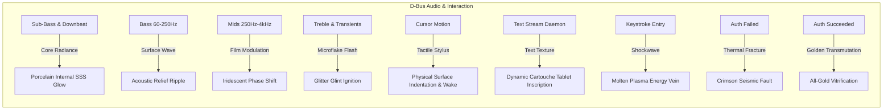

# Archetype 09: The Embossed Glyph Matrix (Chrono-Glyph Bas-Relief & Shifting Materials)

## 1. Aesthetic Vision
A mesmerizing, architectural bas-relief monolith wall scrolling gently across the screen, engraved with a vast, borderless field of **organically scattered esoteric glyphs, ancient runes, classical multi-font letters, and real-time command text (e.g. `fortune`)**.

Rather than a rigid tile grid or a static stone carving:
* **Organic Non-Grid & Guaranteed Clearance (No Overlaps)**: Glyphs are distributed with natural randomized jittering across a 3x3 cellular neighborhood without rectangular tile borders or visible grid seams. Bounded jitter and proportional cell scaling mathematically guarantee that adjacent glyphs **never overlap or touch**.
* **Upright Epigraphic Alignment**: All procedural glyphs are strictly aligned right-side up, perfectly matching the orientation of standard text.
* **Golden Ratio Portrait Quote Inscriptions (No Border)**: Real-time quotes from fortune or custom sources dynamically adapt an enclosing area proportioned strictly to the **golden ratio in portrait mode** ($1 : 1.618$), adjusting to the smallest footprint that comfortably holds the quote without clipping. All artificial borders and frame rims have been removed, presenting pure, chiseled monumental typography.
* **Guaranteed Quote Clearance (No Gaping Dead Space)**: The dynamic portrait golden ratio quote area ($1 : 1.618$) tightly encloses the fortune text with zero wasted black margins. Procedural glyphs are excluded strictly by their outer bounding radius, causing runes and glyphs to hug the inscribed quote snugly without leaving empty deserts of blank stone.
* **Rich Variety of Fonts & Weights**:
  * *Procedural Glyphs*: 24 glyphs across 6 distinct typographic styles (Classical Antiqua, Modernist Sans, Greek Epigraphic, Elder Futhark runes, Cuneiform, Alchemical sigils) with dynamic stroke weights ranging from delicate hairline ($0.015$) to extra bold / black ($0.033$).
  * *Fortune Inscriptions*: Cycles through curated typographic profiles (Classical Antiqua, Editorial Didone, Monumental Grotesque, Humanist Book Serif, Lapidary Epigraphic, Technical Monospace) with varying weights (`Light`, `Normal`, `Medium`, `Bold`, `Black`), letter-spacing, and line heights.
* **Configurable Spacing & Zoom**: Independent user sliders for **Glyph Spacing** ($0.6\times - 2.5\times$) and **Field Zoom Scale** ($0.4\times - 2.5\times$) to seamlessly transition from dense, intimate glyph studies to panoramic vistas.
* **Independent Holographic Stickers & CD Diffraction (Isolated to 2 Themes)**:
  * Holographic effects are modeled as **physical holographic foil stickers** (circular serrated seals, rounded security tags, hexagonal badges, and 8-pointed starbursts) stuck onto the monolith with their own raised thickness, edge bevel, and glossy metallic foil base.
  * Microscopic concentric circular diffraction tracks project the unmistakable **dual-fan CD rainbow diffraction beams** and holographic security watermarks.
  * Stickers are completely independent from the glyph grid and can **freely overlap embossed glyphs, stone, and chiseled quotes**.
  * **Theme Isolation**: CD diffraction and holographic stickers are strictly active on only **two themes** (*Cybernetic Bismuth & Hologram Stickers* and *Prismatic Opal & Hologram Stickers*), while the other 7 classical themes remain pure, matte, and free of artificial stickers.
  * **Off-Screen Generation & Continuous Persistence (Zero Mid-Screen Popping)**:
    * Stickers are **never spawned or deleted in the middle of the screen**.
    * As the material scrolls from bottom-right towards top-left, candidate sticker grid cells are evaluated as they cross the off-screen entry boundary ($uv \in [0.95, 1.25]$).
    * If a holographic theme is active when a candidate cell reaches the entry boundary, the sticker is spawned and affixed to that material cell.
    * Once affixed, the physical sticker **persists continuously across subsequent theme transitions** (e.g., shifting into non-holographic jade or marble), maintaining its metallic foil, micro-relief, and iridescent diffraction until it naturally scrolls completely past the exit edges ($uv < -0.25$).
    * If a non-holographic theme is active as a cell crosses the entry boundary, no sticker is spawned, preventing any sudden popping if a holographic theme activates later while that cell is in view.
* **Scroll-Synchronized Quote Transitions (Zero In-View Popping)**:
  * Quote updates are no longer governed by a blind timer. Instead, the QML engine tracks the exact vertical phase of the quote in scrolling material space:
    $$\text{quoteCoord}_y = (1.9 \times \text{zoom} + \text{scrollVec}_y) \times 0.055 + 0.45$$
  * While on screen ($\text{quotePhase} \in [0.23, 0.77]$), the inscribed tablet remains completely rock-solid and stable.
  * The exact instant the old quote scrolls past the top edge of the screen ($\text{quotePhase} > 0.77$), the engine triggers a background update.
  * A fresh fortune is loaded, the font profile and weight are cycled, and the next tablet arrives from the bottom edge bearing a **brand new fortune**.
* **Live Fortune Generation Pipeline**:
  * *Interactive Harness*: `tools/harness/runner.py` directly executes `/usr/games/fortune -s` (or user custom command) on demand via Python subprocess and atomic IPC, feeding fresh quotes in real-time.
  * *KDE Plasma Session*: `crates/regel-daemon` automatically spawns a lightweight background thread updating `/tmp/regel_fortune.txt` every 12 seconds with atomic file swap.
  * *Built-in Curated Philosophical Deck*: 42 diverse quotes from Marcus Aurelius, Seneca, Rumi, Dickinson, Einstein, Feynman, Sagan, Borges, Blake, Shelley, Nietzsche, Emerson, Thoreau, Watts, and more, guaranteeing rich, continuous variety even when `fortune` is not installed.
* **Randomized Embossing & Debossing**: Individual glyphs and text passages are distributed randomly between **embossed** (raised, convex plateau catching light from above) and **debossed** (sunken, engraved intaglio casting shadows within the groove).
* **Affixed Material Textures**: All material textures—microflake metallic glitter, rock grain, porcelain veins, and iridescent oil-slick patches—are locked to the material coordinates, scrolling in rigid lockstep with the physical monolith.
* **4× Expanded Scroll Speed**: Full velocity slider range expanded from `0.1` up to `8.0` for everything from geological tectonic drift to rapid stream reading.
* **Continuous Theme Auto-Cycling**: Material themes smoothly morph into one another at a configurable interval (seconds), cross-fading colors, glitter, and holographic optical characteristics with seamless ease.

---

## 2. Event-to-Effect Mapping

### Complete Event Matrix

| Event / Signal | Physical Telemetry Reaction | Optical & Material Metaphor |
| :--- | :--- | :--- |
| **Idle Ambient Drift** | Slow, hypnotic diagonal creeping scroll ($v \in [0.1..8.0]$). Microflakes, stone micrograin, and material veins move in lockstep with the carved relief. | Geological time lapse; solid stone slab translation. |
| **Mouse Hover & Cursor Sweeps** | The cursor acts as a pressure stylus: it physically indents the stone/porcelain surface (smooth Gaussian depression) and leaves a fluid trailing wake along the velocity vector, naturally catching ambient directional light without blinding glare. | Sculptor pressing a stylus or thumb into pliable porcelain and clay. |
| **Sub-Bass & Bass Cadence** | Bass energy gently supports the monolith's natural kinetic drift velocity without any full-screen luminance strobing, normal vibration, or lighting flashes. | Tranquil geological stability; steady tectonic motion. |
| **Mids & Singing Vocal Energy** | Vocal frequencies enrich chromatic depth within holographic and thin-film layers with smoothly filtered transitions, preserving steady overall ambient lighting. | Natural chromatic resonance with zero global flicker. |
| **Treble & Microflake Glints** | Microflakes catch specular glints strictly through directional light geometry as facets align, maintaining calm, steady ambient illumination. | Crystalline mineral flakes embedded in solid stone. |
| **Live Fortune & Tablet Inscriptions** | Queries `/usr/games/fortune -s` (or user command/custom text) and renders the quote and author into a dynamic cartouche tablet with proportional sizing and word-wrap. | Ancient stone stelae bearing living prophetic inscriptions. |
| **Lock Screen Keystroke (`onKeyStroke`)** | Each keypress radiates a circular shockwave ripple that displaces the relief height and charges the engraved glyph crevices with luminescent plasma energy veins. | Energetic conduit ignition through carved runes. |
| **Authentication Failure (`onAuthFailed`)** | A violent crimson shockwave detonates across the monolith, shattering the porcelain glaze and filling the glyph engravings with smoldering amber fault lines. | Seismic rupture of a sacred architectural stele. |
| **Authentication Success (`onAuthSucceeded`)** | The entire monolith transmutes into high-karat gilded vitreous enamel, accelerating smoothly to clear into the user's desktop. | Alchemical transmutation and aperture dissolution. |

---

## 3. Shader & Physical Optics Architecture

### Borderless Jittered Glyph Evaluation
The shader evaluates a 3x3 cellular neighborhood around each point. Each cell has an independent pseudo-random position jitter ($\pm 0.28$), scale ($0.55\times - 0.71\times$), tilt angle ($\pm 8^\circ$), stroke weight ($0.015 - 0.033$), glyph ID ($0..107$), and emboss sign ($\pm 1.0$). By avoiding any bounding cell frames, the glyphs float organically across the monolith.

### Expanded Procedural SDF Library (108 Distinct Glyphs)
The procedural signed distance field engine incorporates **108 distinct glyphs** spanning diverse historical fonts, technical scripts, mathematical symbols, and tactile emojis. Every glyph is dynamically scalable, supports continuous stroke weight morphing (hairline to heavy black), and can be embossed (raised with gilded inlay) or debossed (sunken chiseled relief).

#### 1. Classical Roman Serif & Modern Technical Sans-Serif (IDs 0..28)
* **Serif Letters (IDs 0..15)**: **A** (apex & foot serifs), **B** (dual bracketed bowls), **C** (terminal serifs), **D** (fluted stem & arch), **E** (slab serifs), **G** (spur & pilaster), **M** (twin pilasters & apex), **N** (diagonal spine), **Q** (calligraphic tail), **R** (flared diagonal leg), **S** (curved spine), **T** (crossbar & serifs), **V** (chiseled apex), **W** (interlaced chevrons), **Z** (slab terminals), **&** (typographic ampersand).
* **Technical Sans-Serif & Digits (IDs 16..28)**: **F**, **H**, **J**, **K**, **L**, **P**, **U**, **X**, **Y**, **1**, **4**, **7**, **8** (clean geometric strokes with orthogonal terminals).

#### 2. Historic Scripts: Fraktur, Greek, Runes & Cyrillic (IDs 29..58)
* **Blackletter / Fraktur Epigraphy (IDs 29..36)**: **𝕬**, **𝕭**, **𝕯**, **𝕱**, **𝕲**, **𝕳**, **𝖄**, **𝖅** (diamond lozenges, ribbed verticals, and Gothic cusps).
* **Greek Epigraphic Typography (IDs 37..46)**: **$\Omega$** (Omega), **$\Psi$** (Psi), **$\Phi$** (Phi), **$\Theta$** (Theta), **$\Sigma$** (Sigma), **$\Lambda$** (Lambda), **$\Xi$** (Xi), **$\Pi$** (Pi), **$\Delta$** (Delta), **$\Gamma$** (Gamma).
* **Elder Futhark Runes (IDs 47..54)**: **ᛉ** (*Algiz* / Elk), **ᛟ** (*Othila* / Heritage), **ᚠ** (*Fehu* / Wealth), **ᛏ** (*Tiwaz* / Sky God), **ᚢ** (*Uruz* / Ox), **ᚦ** (*Thurisaz* / Thorn), **ᚨ** (*Ansuz* / Odin), **ᚲ** (*Kenaz* / Torch).
* **Cyrillic Epigraphy (IDs 55..58)**: **Ж** (Zhe / Butterfly), **Ф** (Ef / Dual Lobe), **Ю** (Yu / Pillar & Circle), **Д** (De / Classical Pediment).

#### 3. Esoteric, Mathematical & Alchemical (IDs 59..80)
* **Ancient Hebrew Epigraphy (IDs 59..64)**: **א** (*Aleph*), **ב** (*Bet*), **ג** (*Gimel*), **ד** (*Dalet*), **ש** (*Shin*), **ת** (*Tav*).
* **Mathematical & Logic Symbols (IDs 65..72)**: **$\infty$** (Infinity), **$\nabla$** (Nabla / Del), **$\partial$** (Partial Derivative), **$\oint$** (Contour Integral), **$\in$** (Element Of), **$\forall$** (For All), **$\exists$** (Exists), **$\angle$** (Angle).
* **Planetary & Alchemical Sigils (IDs 73..80)**: **☉** (Astrological Sun), **☽** (Crescent Moon), **☿** (Alchemical Mercury), **♃** (Jupiter), **♄** (Saturn), **♂** (Mars), **♀** (Venus), **🜂/🜄** (Merkaba / Elemental Transmutation).

#### 4. Emojis & Iconic Emblems (IDs 81..107)
* **81. 👁️ The All-Seeing Eye**: Opposing arc eyelids with central circular iris and pupil dot.
* **82. ⚡ Lightning Bolt**: Jagged 3-stage electrostatic discharge chevron.
* **83. 🌙 Crescent Moon**: Sickle crescent curve with sharp cusp terminals.
* **84. 🪐 Ringed Exoplanet / Saturn**: Spherical body surrounded by an inclined elliptical planetary ring disk.
* **85. ⭐ 5-Point Celestial Star**: Classical faceted 5-pointed star.
* **86. 🗝️ Skeleton Key**: Circular key ring bow, long notched shaft, dual ward bits.
* **87. ⚔️ Crossed Swords**: Dual crossed rapier blades with crossguards and pommels.
* **88. 🛡️ Knight's Shield**: Heraldic heater shield outline with central cross emblem.
* **89. 👑 Imperial Crown**: 5-peaked royal coronet with pearl finial gems.
* **90. 💎 Brilliant Diamond**: Faceted gemstone with crown table and sharp pavilion culet.
* **91. ⌛ Hourglass**: Dual conical glass bulbs with cross-bracing and sand core.
* **92. ⚓ Nautical Anchor**: Top eyelet, stock crossbar, vertical shank, curved flukes with pointed crowns.
* **93. ⚙️ Precision Cogwheel**: Inner hub ring, outer rim, 8 radial gear teeth.
* **94. 🌀 Cosmic Spiral Galaxy**: Logarithmic dual Archimedean spiral arms.
* **95. 🪶 Quill Feather**: Curved rachis shaft with tapered lateral vanes.
* **96. 🕯️ Sacred Candle Flame**: Scribed wick with teardrop flame body.
* **97. 🏹 Archer's Bow & Arrow**: Curved bow stave, taut string, notched arrow with diamond head.
* **98. 🔱 Poseidon's Trident**: Central barbed spear with semicircular cradle and twin outer prongs.
* **99. ❤️ Sacred Heart**: Classical dual-lobed cardiovascular heart with tapered tip.
* **100. 💀 Memento Mori / Skull**: Domed cranium, eye sockets, and chiseled maxillary jaw.
* **101. 🔥 Sacred Fire**: Triple-tongue flame with rising lick peaks.
* **102. 🌱 Seed of Life / Sprout**: Upright stem with dual cotyledon leaves.
* **103. ⚖️ Scales of Justice**: Fulcrum column, horizontal balance beam, dual suspended pans.
* **104. 🧭 Navigator's Compass Rose**: 360° outer ring with 4-point cardinal diamond star.
* **105. 🔮 Divination Crystal Orb**: Glowing sphere atop an arched tripod stand.
* **106. ⛩️ Shinto Torii Gate**: Curved *kasagi* lintel, horizontal *nuki* tie-beam, twin pillars.
* **107. 🧬 DNA Double Helix**: Intertwined helical strands with horizontal base-pair rungs.

### Compact Disc & Holographic Security Sticker Optics
Unlike uniform rainbow washes, real holographic foil stickers combine a reflective metallic mirror substrate with intricate micro-etched diffraction gratings forming crisp vector emblems, security logomarks, and guilloche patterns.

#### 1. High-Contrast Substrate vs. Vector Emblems
* **Substrate (Negative Space)**: High-specular polished silver chrome or imperial gold mirror foil with subtle micro-dot security lattice watermarks.
* **Graphic Vector Emblems**: Intricately etched diffraction lines that burst with vivid multi-order rainbow light under specular angles, framed by micro-chiseled 3D normal relief bevels (`embH = 0.006`).

#### 2. Procedural Geometric Emblem Library
Each sticker shape has its own distinct vector design:
1. **Shape 0: Authenticity Guilloche Rosette & 8-Point Faceted Star (Circular Seal)**:
   * Concentric micro-beaded security rims and outer gear border.
   * Multi-frequency spirograph Guilloche ribbon: $r_g = 0.56 + 0.11 \sin(8\theta + 1.6 \sin 16\theta)$.
   * Inner seal border with micro-teeth, enclosing a faceted 8-point geometric star and central circumpunct.
2. **Shape 1: Cybernetic IC Processor Die & PCB Circuit Bus (Security Badge)**:
   * Dual outer security borders with corner optical registration reticles (L-brackets) and micro-barcode stripes.
   * Orthogonal PCB circuit bus traces with 45-degree angled bends and solder via termination pads.
   * Central silicon processor die with stepped concentric rings and core chip logo.
3. **Shape 2: Sacred Metatron Mandala & Alchemical Hexagram (Hexagonal Prism)**:
   * Concentric hexagonal borders with perimeter radial tick marks and 6 radial structural spokes.
   * Interlocking dual equilateral triangles forming the sacred Merkaba Star of David hexagram.
   * Six orbital Flower of Life sacred circles and central eye core node.
4. **Shape 3: Imperial Starburst Medallion & Heraldic Shield (8-Point Starburst)**:
   * 16 razor-sharp radiating sunburst wedge beams and notched laurel gear ring.
   * Central heraldic diamond shield with double border enclosing a solid royal cross, corner fleurons, and crest jewel.

#### 3. Dual-Channel Kinetic Color-Flipping (Angle Multiplexing)
Authentic security holograms etch different graphic elements with orthogonal grating orientations. When the light moves or the view angle tilts, complementary elements flip between fiery red/gold and emerald/cyan:
* **Channel A (Outer frames, guilloche ribbons, circuit traces, radial sunbursts)**:
  $$\vec{T}_{\text{cdA}} = \text{normalize}(\vec{T}_{\text{disc}} - \vec{N}(\vec{N} \cdot \vec{T}_{\text{disc}})), \quad \vec{B}_{\text{cdA}} = \text{normalize}(\vec{N} \times \vec{T}_{\text{cdA}})$$
  $$\lambda_A = (\vec{T}_{\text{cdA}} \cdot (\vec{L} - \vec{V})) \cdot 26.0 + r_{\text{track}} \cdot 16.0 + \text{time} \cdot 0.18 + \text{mids} \cdot 1.4$$
  $$\vec{C}_A = \frac{1}{2} + \frac{1}{2}\cos\left(2\pi \left(\lambda_A + \left[0.0, 0.33, 0.67\right]\right)\right)$$
* **Channel B (Central emblems, silicon die, Merkaba star, heraldic shield)**:
  $$\vec{T}_{\text{cdB}} = \vec{B}_{\text{cdA}}, \quad \vec{B}_{\text{cdB}} = -\vec{T}_{\text{cdA}} \quad (\text{Orthogonal Grating})$$
  $$\lambda_B = (\vec{T}_{\text{cdB}} \cdot (\vec{L} - \vec{V})) \cdot 26.0 + r_{\text{track}} \cdot 22.0 + \frac{\pi}{2} + \text{time} \cdot 0.18 + \text{mids} \cdot 1.4$$
  $$\vec{C}_B = \frac{1}{2} + \frac{1}{2}\cos\left(2\pi \left(\lambda_B + \left[0.0, 0.33, 0.67\right]\right)\right)$$
* **Etched Laser Glint**: High-exponent highlight along emblem contours: $(\vec{N} \cdot \vec{H})^{110} \cdot 2.0$.

#### 4. Deterministic Off-Screen Lifecycle & Persistent Uniform Slots
To ensure physical realism and eliminate jarring popping:
* **Off-Screen Spawn Zone**: Material points enter the visible screen at $uv \ge 1.0$ (from bottom and right). Cells are tested for spawn eligibility as they enter the pre-screen buffer $uv \in [0.95, 1.25]$.
* **Theme-Gated Affixing**: When a cell reaches the spawn line, it checks if the active palette has `holo > 0.01`. If enabled, it is affixed with its specific palette intensity.
* **Persistent Material State**: Once a sticker is affixed, it remains in the active sticker set regardless of subsequent theme switches, continuing to diffract and catch light on the stone slab until it passes beyond the top/left screen exit boundaries ($uv < -0.25$).
* **8 Active Vector Slots**: The QML coordinator populates 8 std140 `vec4` uniform slots (`u_sticker0..7`) packing `(cell.x, cell.y, intensity, active_flag)`. The fragment shader directly iterates only active slots with bounding-box rejection, executing faster than previous exhaustive neighborhood loops.

---

## 4. Color Themes & Material Palettes

| Preset | Stone (Matte) | Porcelain (SSS) | Gold Inlay / Glint | Sheen / Tint | Deep Void | Primary Characteristic |
| :--- | :--- | :--- | :--- | :--- | :--- | :--- |
| **01: Imperial Jade & Porcelain (Default)** | `#081c15` (Deep Jade) | `#edf6f9` (Milky Porcelain) | `#d4af37` (Imperial Gold) | `#52b788` (Emerald Sheen) | `#020907` | Balanced Classical Bas-Relief |
| **02: Obsidian & Iridescent Oil-Slick** | `#0b0c10` (Volcanic Basalt) | `#1f2833` (Smoked Glass) | `#66fcf1` (Cyan Diamond) | `#c77dff` (Peacock Violet) | `#000000` | High Thin-Film Iridescence |
| **03: Alabaster & Rose Gold** | `#2b2024` (Porphyry Stone) | `#fff1e6` (Warm Alabaster) | `#e07a5f` (Rose Gold) | `#f4a261` (Topaz Sheen) | `#140d10` | Warm Classical Marble |
| **04: Lapislazuli & Celestial Gold** | `#0d1b2a` (Ultramarine Slate)| `#e0e1dd` (Pearl Vein) | `#e0a96d` (Pyrite Sparkle) | `#415a77` (Celestial Azure) | `#050a12` | Gilded Semi-Precious Mineral |
| **05: Cybernetic Bismuth Monolith** | `#161a1d` (Carbon Substrate) | `#f5f3f4` (Glazed Enamel) | `#ffb703` (Gold Circuit) | `#00b4d8` (Anodized Bismuth)| `#0b090a` | High Metallic Rainbow Steps |
| **06: Starlight Diamond & Platinum (Ultra Glitter)** | `#0c0e14` (Deep Charcoal) | `#ffffff` (Pure Diamond Crystal) | `#e2e8f0` (Polished Platinum) | `#67e8f9` (Electric Cyan) | `#030408` | Ultra Dense Microflake Glitter |
| **07: Prismatic Opal & Hologram (Ultra Iridescent / CD Hologram)** | `#12101e` (Midnight Indigo) | `#fdfbf7` (Australian Fire Opal) | `#f472b6` (Laser Magenta) | `#38bdf8` (Prismatic Sky) | `#08060f` | Maximum CD Hologram Grating |
| **08: Cosmic Nebula & Amethyst (Glitter & Iridescence)** | `#13091f` (Deep Violet Abyss) | `#f3e8ff` (Amethyst Quartz) | `#d946ef` (Fuchsia Star-dust) | `#06b6d4` (Nebular Teal) | `#06020a` | Glitter + Iridescent Dual Shift |
| **09: Abalone Shell & Oceanic Nacre** | `#041c1e` (Dark Abyss Trench) | `#ecfeff` (Pauwa Shell Nacre) | `#2dd4bf` (Oceanic Turquoise) | `#a78bfa` (Lavender Pearl) | `#020d0e` | Multi-layered Organic Pearl Nacre |

---

## 5. Technical Specifications & Performance
* **Shader Pipeline**: Single-pass Qt 6 RHI fragment shader compiled via `qsb` (`--glsl "100 es,120,330"`).
* **Buffer Layout**: std140 uniform block with 416-byte alignment (including 8 dynamic active sticker uniform vector slots `u_sticker0..7` at offsets 288..415) + `sampler2D u_text_texture` binding at slot 1.
* **Frame Budget**: Evaluates in $<0.8\text{ ms}$ on modern integrated GPUs and $<0.25\text{ ms}$ on discrete GPUs.
* **Memory Footprint**: Only 1 lightweight offscreen texture (512 KB) for dynamic command typography; 100% procedural glyphs and microflakes.
* **Daemon Integration**: `tools/fortune-stream.sh` periodically updates `/tmp/regel_fortune.txt` with atomic replacement, ensuring zero stutter during file reads.
